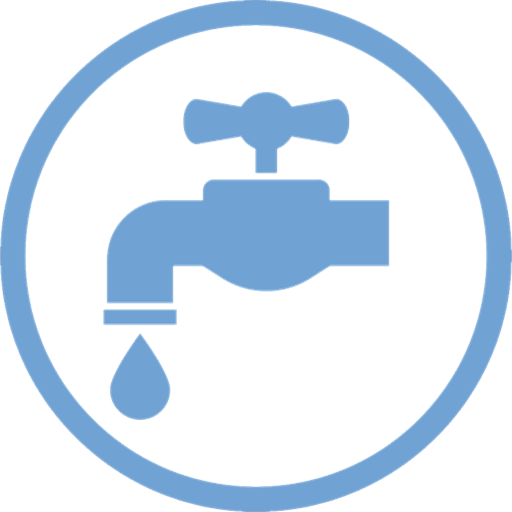

---
title: On Arrival &#8729; Checklists 
---

<link href="../styles/custom.css" rel="stylesheet" />

# On Arrival

Activate the site facilities available:

<ol class="togglelist">
    <li>
        
    </li>
    <li>
        
    </li>
    <li>
        
    </li>
</ol>

## Checklist

<label><input type="checkbox" /> Select as flat and level a parking site as possible. Use leveling blocks if
required.</label>
<label class="power-N"><input type="checkbox" />Ensure the solar panels are not covered by shade as then they 
will not charge the 12V battery properly.</label>
<label class="power-Y"><input type="checkbox" /> Connect 240V electricity  
<em>Check if <a href="../guides/hoses-and-cables.html">15A to 10A Power Adaptor</a> is required.</em></label>
<label class="water-Y"><input type="checkbox" /> Connect to city water </label>
<label class="greywater-Y"><input type="checkbox" /> Connect greywater </label>
<label><input type="checkbox" /> Ensure LPG gas bottle is open</label>
<label><input type="checkbox" /> Turn on button 1-3 on the <a href="../guides/control-panel.html">Battery and Water Control Panel</a>.</label>
<label class="water-N"><input type="checkbox" /> Turn the water pump on. 
<em>Button 4 on the <a href="../guides/control-panel.html">Battery and Water Control Panel</a></em>
</label>
<label class="power-N"><input type="checkbox" /> Turn the hot water heater on using the Gas button. 
<em>The <a href="hot-water-heater-controls.md">Hot Water Heater Controls</a> are located on the left-hand side back lounge area</em></label>
<label class="power-Y"><input type="checkbox" /> Turn the hot water heater on using the Electric button. 
<em>The <a href="hot-water-heater-controls.md">Hot Water Heater Controls</a> are located on the left-hand side back lounge area</em></label>
<label class="power-N"><input type="checkbox" /> Ensure the refrigerator (in auto mode) is switched to LPG gas.</label>
<label class="power-Y"><input type="checkbox" /> Ensure the refrigerator (in auto mode) is switched to 240V.</label>
<label class="power-N"><input type="checkbox" /> Ensure the refrigerator fan is switched on.</label>

> **Please note!** If using LPG gas, it can take up to **20 minutes** before the fridge turns on. 
>
> The refrigerator must be level and will not operate if not parked on a flat surface.

<a href="pre-departure.html"><button class="nav-button"><i class="arrow arrow-left"></i> Pre-Departure</button></a>
<a href="pre-return.html" class="right"><button class="nav-button">Pre-Return <i class="arrow arrow-right"></i></button></a>

