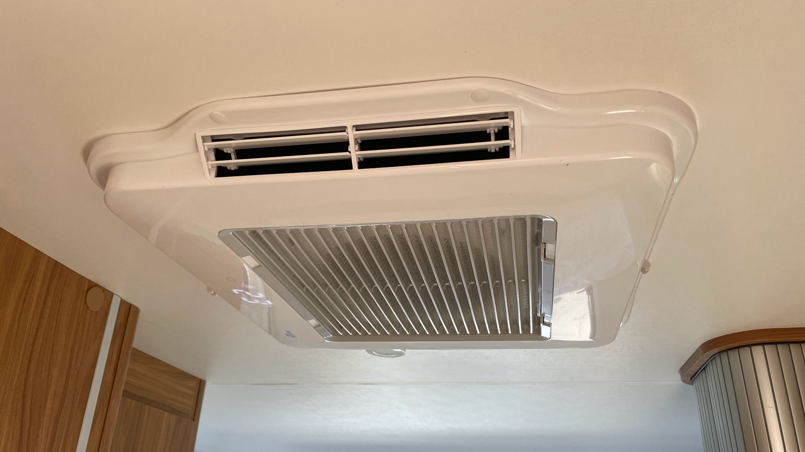
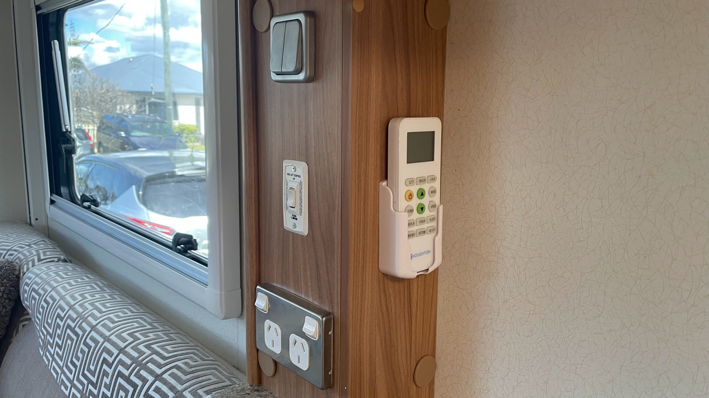
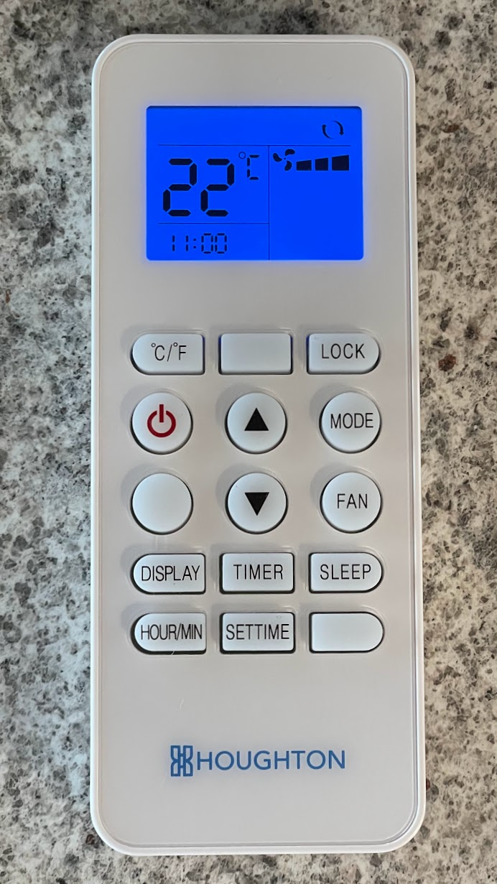
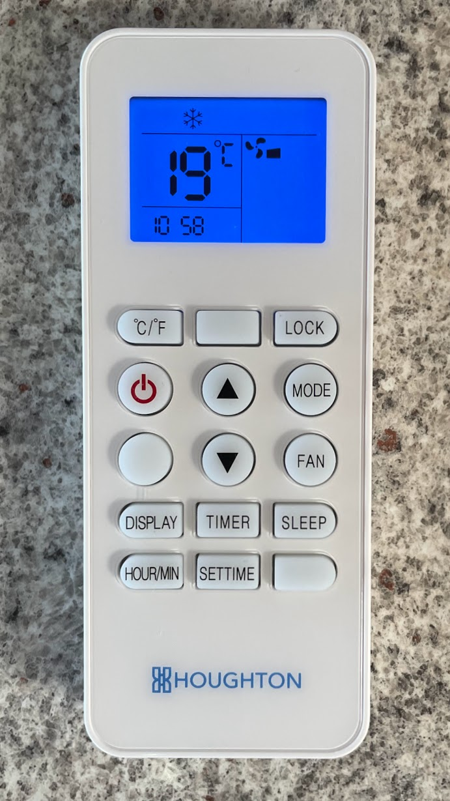
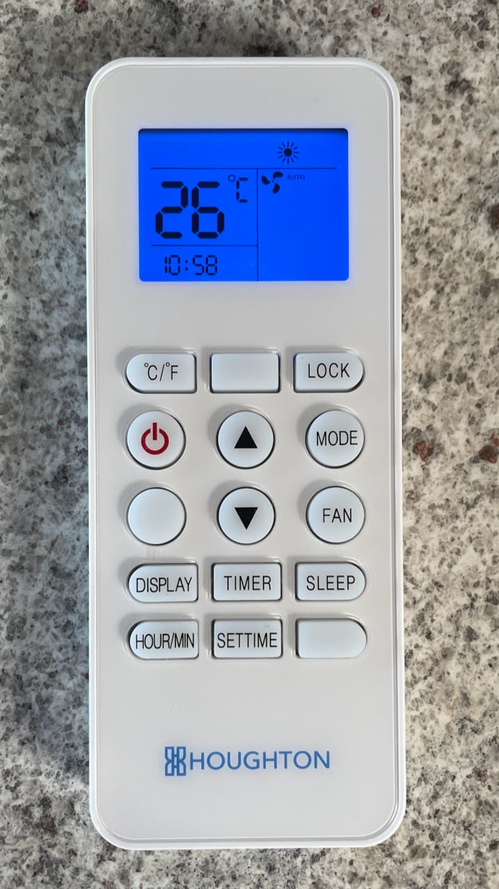
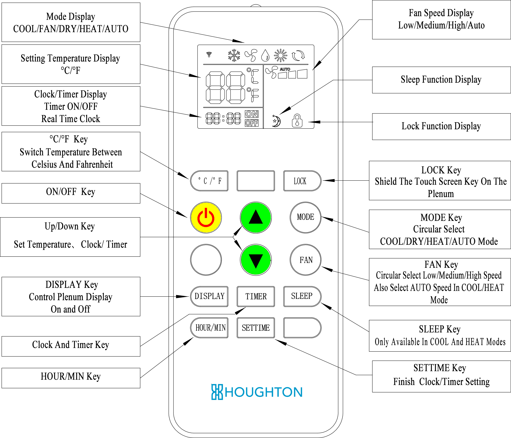
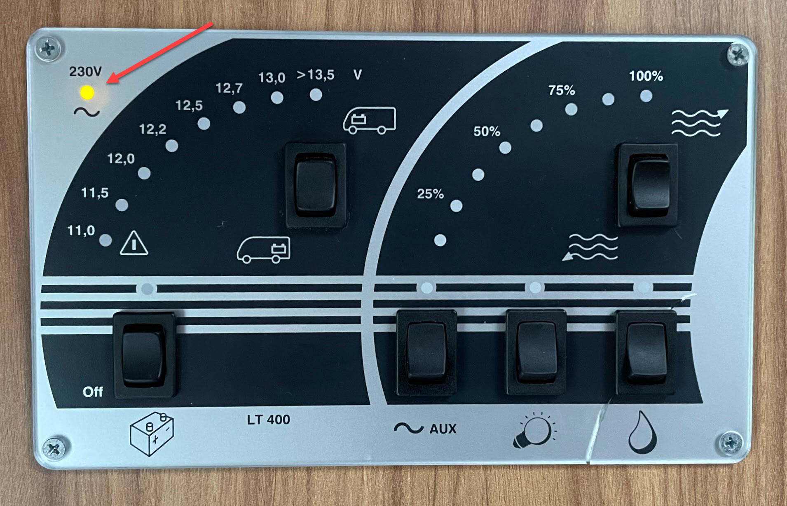
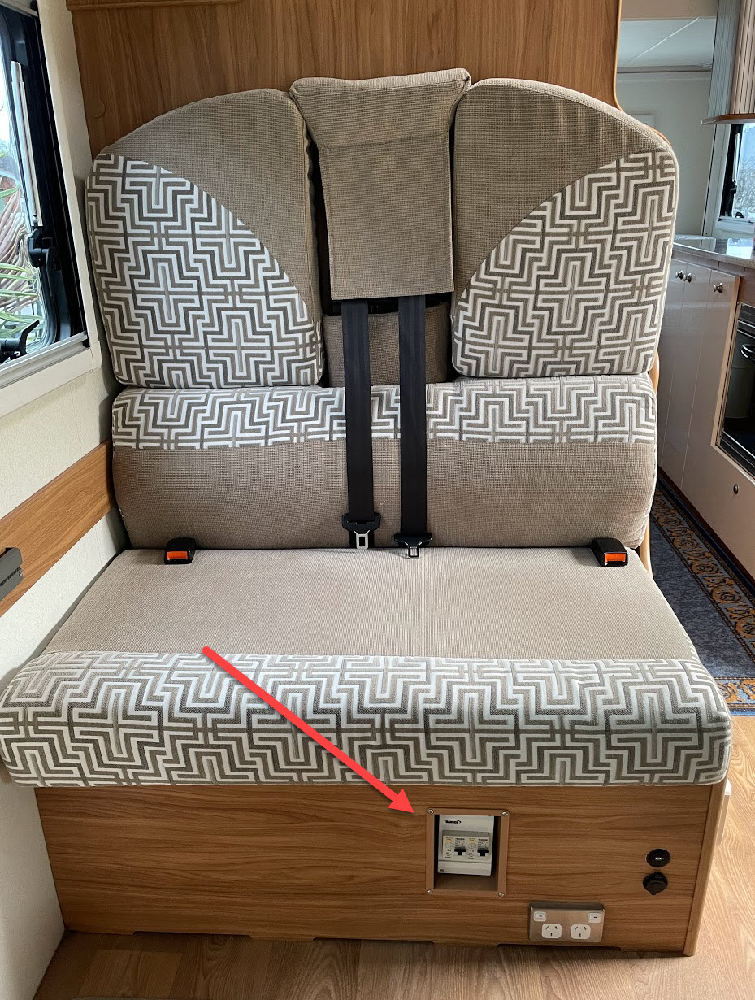
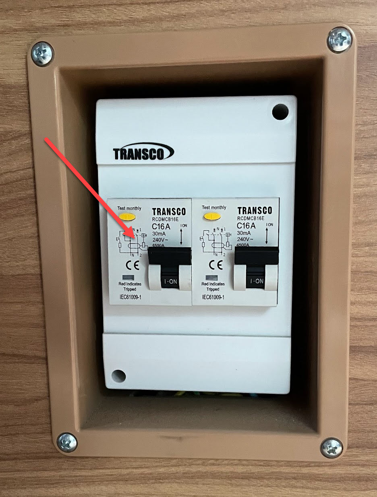

<link href="../styles/custom.css" rel="stylesheet" />
<link rel="stylesheet" href="https://cdn.jsdelivr.net/npm/bootstrap@4.6.1/dist/css/bootstrap.min.css" integrity="sha384-zCbKRCUGaJDkqS1kPbPd7TveP5iyJE0EjAuZQTgFLD2ylzuqKfdKlfG/eSrtxUkn" crossorigin="anonymous">

# Air Conditioner
Lillen has a roof mounted reverse cycle Air Conditioner with easy to read LED display showing temperature and mode.
It has a three speed, ultra-quiet, high efficiency fan and a remote control with cooling, heating, dehumidifying, dry, sleep and timing functions.

    <svg class="svg-inline--fa fa-info-circle fa-w-16" aria-hidden="true" focusable="false" data-prefix="fas" data-icon="info-circle" role="img" xmlns="http://www.w3.org/2000/svg" viewBox="0 0 512 512" data-fa-i2svg=""><path fill="currentColor" d="M256 8C119.043 8 8 119.083 8 256c0 136.997 111.043 248 248 248s248-111.003 248-248C504 119.083 392.957 8 256 8zm0 110c23.196 0 42 18.804 42 42s-18.804 42-42 42-42-18.804-42-42 18.804-42 42-42zm56 254c0 6.627-5.373 12-12 12h-88c-6.627 0-12-5.373-12-12v-24c0-6.627 5.373-12 12-12h12v-64h-12c-6.627 0-12-5.373-12-12v-24c0-6.627 5.373-12 12-12h64c6.627 0 12 5.373 12 12v100h12c6.627 0 12 5.373 12 12v24z"></path></svg>
    <strong>Note:</strong> Connection to 240V mains power is required.

### Remote Control 
The remote to the Air Conditioner is mounted on the wall under the TV unit. 

#### Modes

    <svg class="svg-inline--fa fa-lightbulb fa-w-11" aria-hidden="true" focusable="false" data-prefix="fas" data-icon="lightbulb" role="img" xmlns="http://www.w3.org/2000/svg" viewBox="0 0 352 512" data-fa-i2svg=""><path fill="currentColor" d="M96.06 454.35c.01 6.29 1.87 12.45 5.36 17.69l17.09 25.69a31.99 31.99 0 0 0 26.64 14.28h61.71a31.99 31.99 0 0 0 26.64-14.28l17.09-25.69a31.989 31.989 0 0 0 5.36-17.69l.04-38.35H96.01l.05 38.35zM0 176c0 44.37 16.45 84.85 43.56 115.78 16.52 18.85 42.36 58.23 52.21 91.45.04.26.07.52.11.78h160.24c.04-.26.07-.51.11-.78 9.85-33.22 35.69-72.6 52.21-91.45C335.55 260.85 352 220.37 352 176 352 78.61 272.91-.3 175.45 0 73.44.31 0 82.97 0 176zm176-80c-44.11 0-80 35.89-80 80 0 8.84-7.16 16-16 16s-16-7.16-16-16c0-61.76 50.24-112 112-112 8.84 0 16 7.16 16 16s-7.16 16-16 16z"></path></svg>
    <strong>Tip:</strong> Press the <b>DISPLAY</b> button on the remote to turn the plenum LED display ON or OFF.

Example of setting the remote at 22 degress **Auto**

Example of setting the remote at 19 degress **Cool**

Example of setting the remote at 26 degress **Heat**

#### Quick Reference Guide

## Manual
The manufacturers operating manual is available as a [PDF download](/docs/air-conditioner.pdf). 

## Troubleshooting
If the Air Conditioner will not power on follow the below steps.

1. Ensure that external 240V is connected by ensuring the 230V light is lit on the [Battery and Water Control Panel](/guides/control-panel.md).

2. Ensure that the 240v fuse has not tripped

The 240V Fuse Box is mounted on the passenger couch behind the driver seat.

The left fuse switch is for the Air Conditioner.

<a href="/guides/#guides"><button class="nav-button"><i class="arrow arrow-left"></i> Back</button></a>

