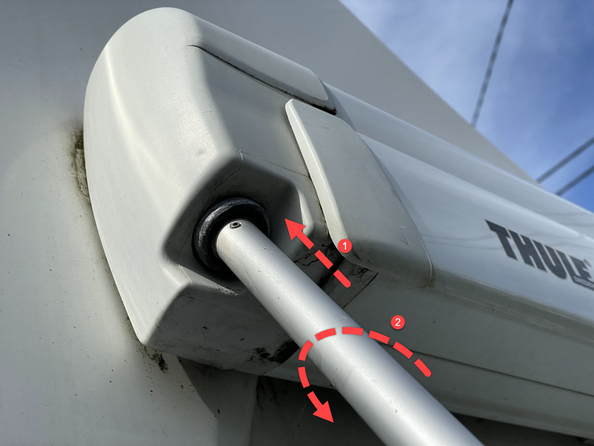
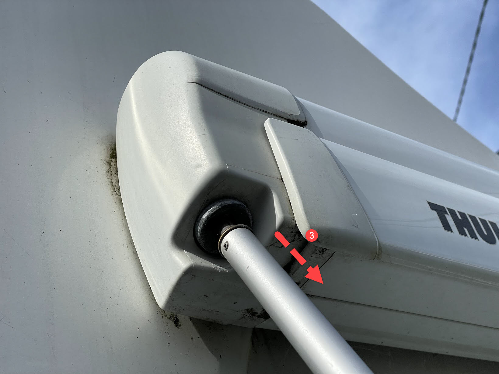
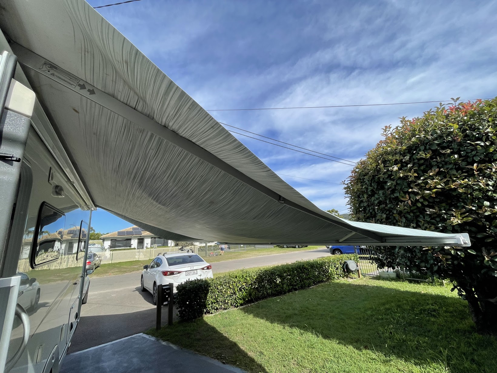
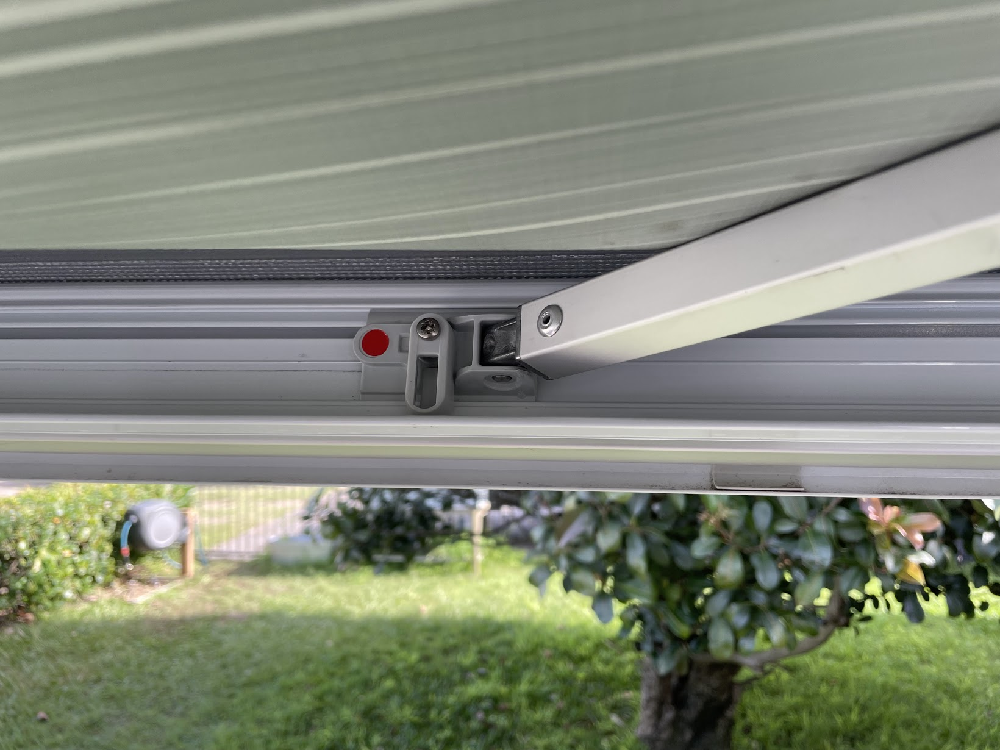
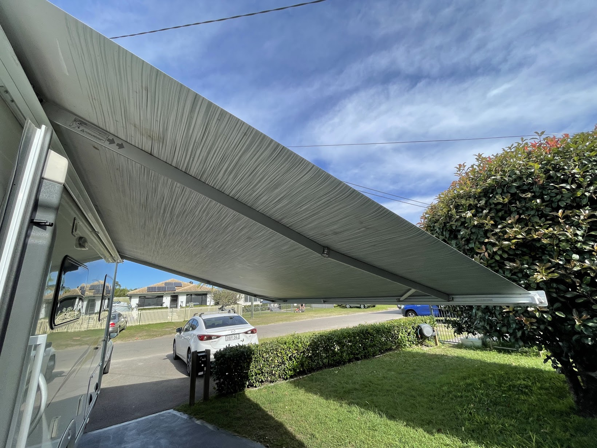
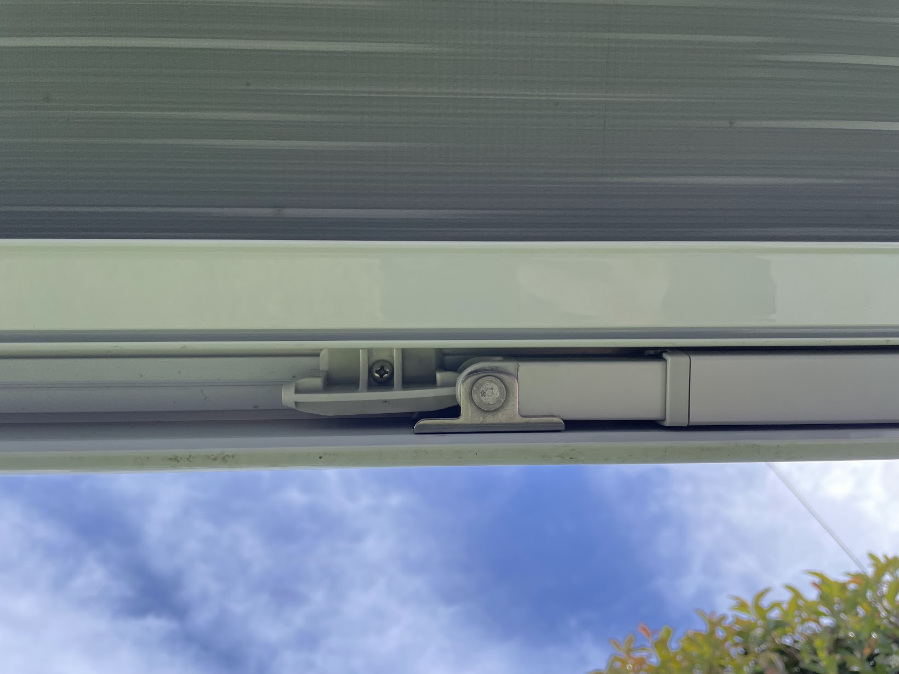
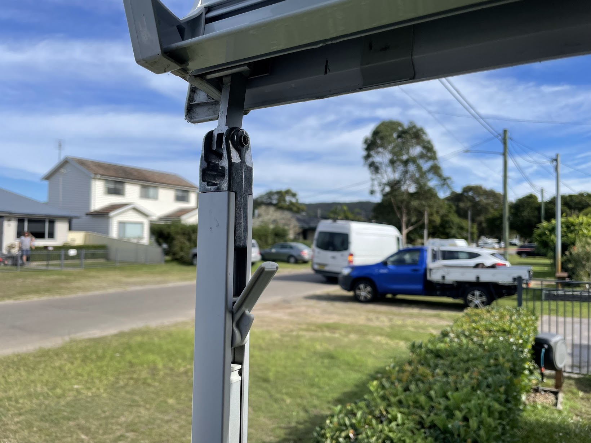
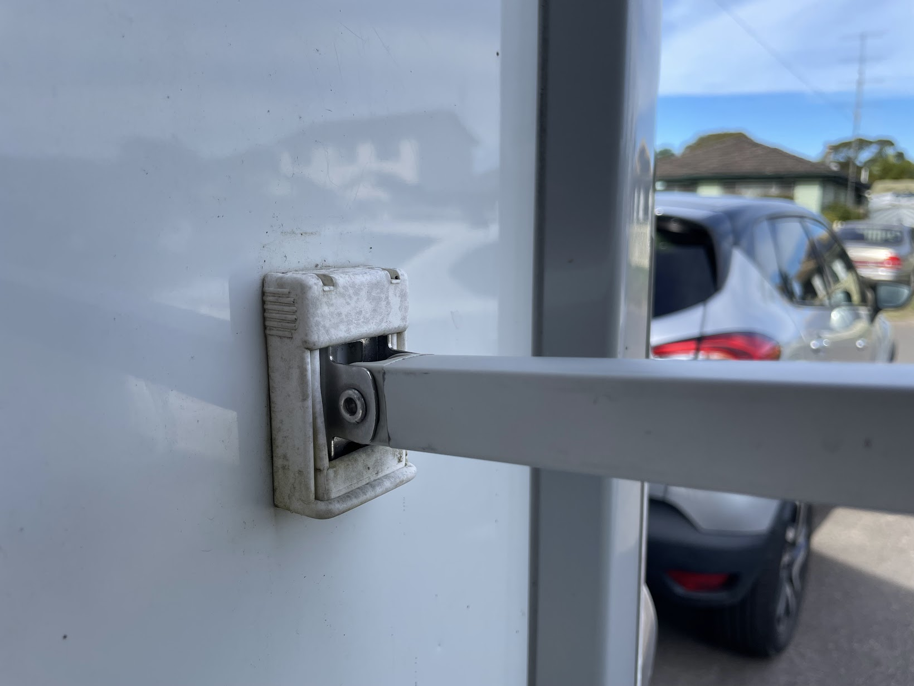

<link href="../styles/custom.css" rel="stylesheet" />

# Awning

## Insert the Crank Arm
1. Insert the cranck arm fully
2. Rotate the crank arm 90 degrees 

3. Pull the crank arm outwards into locked position

## Wind out the Awning
Wind out the awning so that there is no tension on the fabric

Apply the locks

Apply some tension to the fabric

## Position the Legs
Release the legs by pushing on the spring release 

Lock the legs into place

Optional leg wall connector 

## Manual
The manufacturers operating manual is available as a [PDF download](/docs/awning.pdf). 

<a href="/#guides"><button class="nav-button"><i class="arrow arrow-left"></i> Back</button></a>

