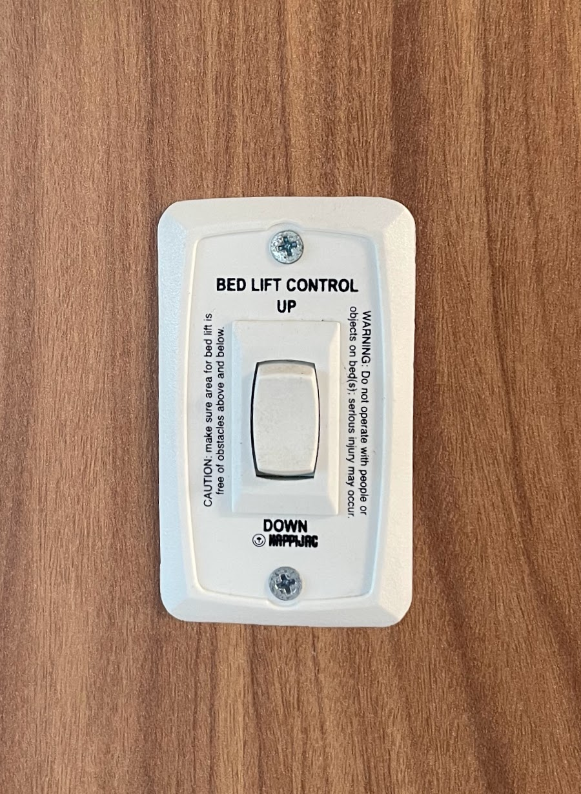
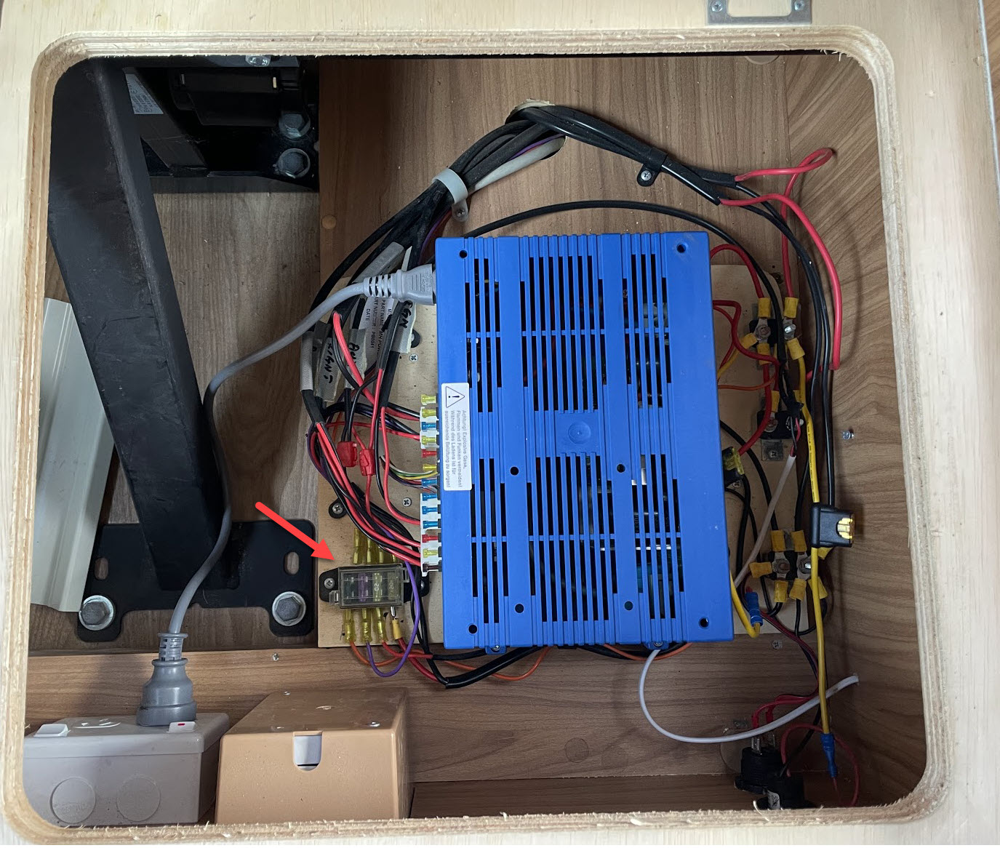
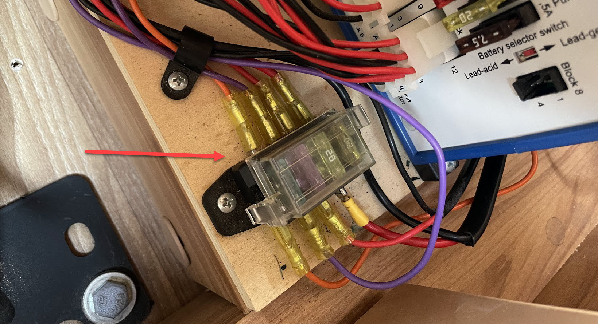
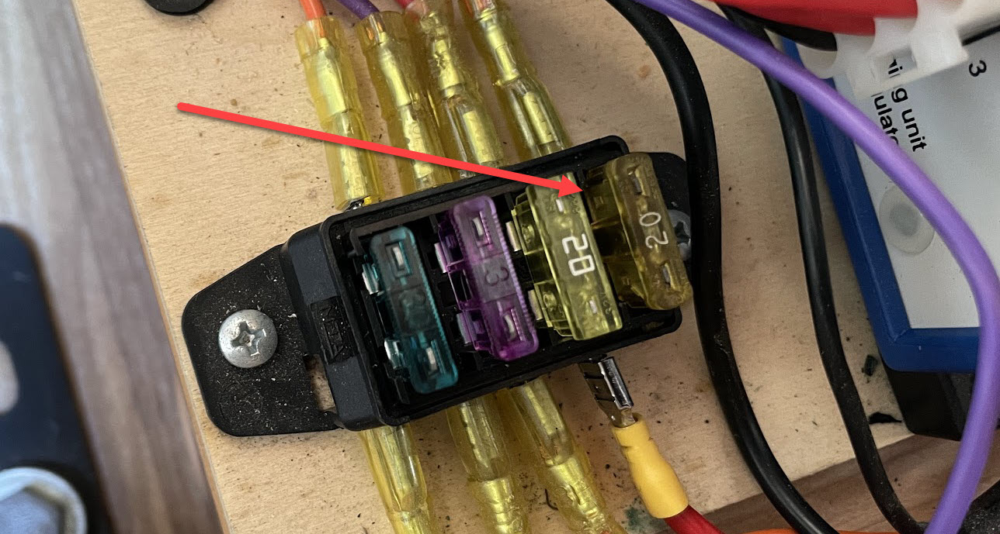
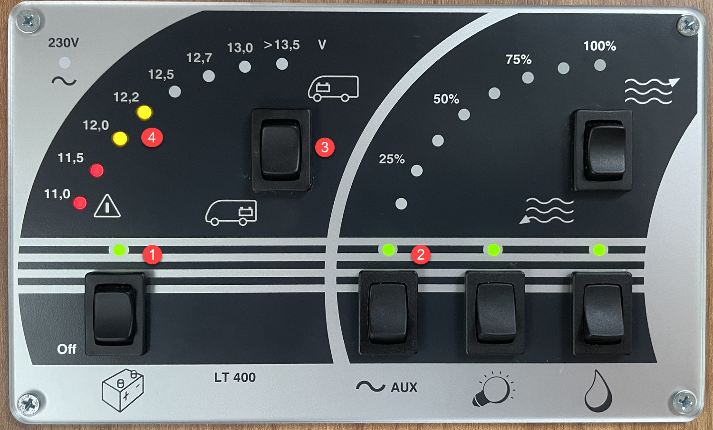
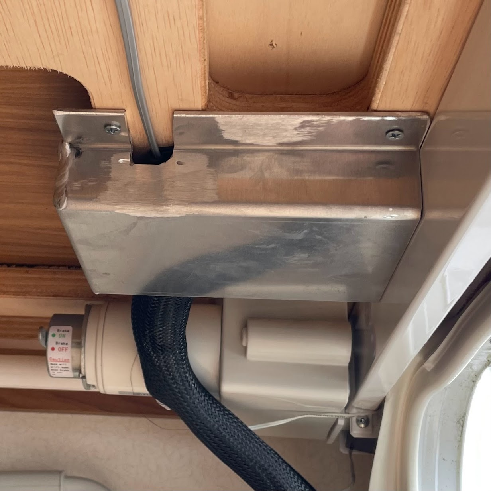
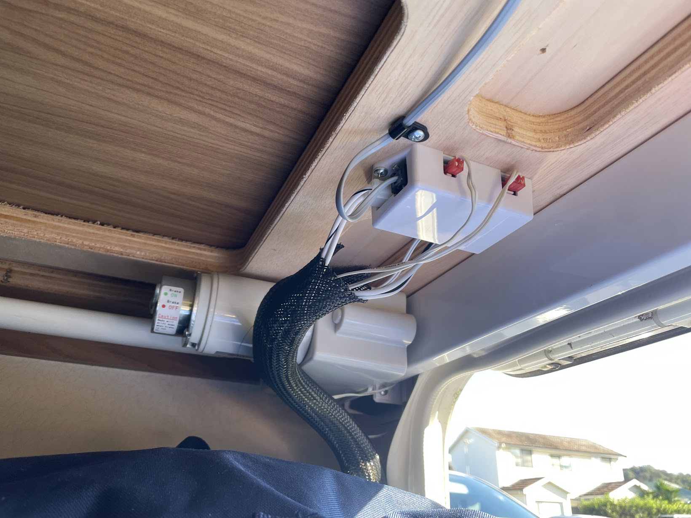

<link href="../styles/custom.css" rel="stylesheet" />
<link rel="stylesheet" href="https://cdn.jsdelivr.net/npm/bootstrap@4.6.1/dist/css/bootstrap.min.css" integrity="sha384-zCbKRCUGaJDkqS1kPbPd7TveP5iyJE0EjAuZQTgFLD2ylzuqKfdKlfG/eSrtxUkn" crossorigin="anonymous">

# Electric Bed
Lillen comes equipped with an electric bed.

The bed is operated from the control switch located under the TV unit. 

Pressing and holding the switch in the UP position moves the bed upward. 

Pressing and holding the switch in the DOWN position, moves the bed downward.

    <svg class="svg-inline--fa fa-triangle-exclamation fa-w-16" aria-hidden="true" focusable="false" data-prefix="fas" data-icon="triangle-exclamation" role="img" xmlns="http://www.w3.org/2000/svg" viewBox="0 0 512 512"><path fill="currentColor" d="M506.3 417l-213.3-364c-16.33-28-57.54-28-73.98 0l-213.2 364C-10.59 444.9 9.849 480 42.74 480h426.6C502.1 480 522.6 445 506.3 417zM232 168c0-13.25 10.75-24 24-24S280 154.8 280 168v128c0 13.25-10.75 24-23.1 24S232 309.3 232 296V168zM256 416c-17.36 0-31.44-14.08-31.44-31.44c0-17.36 14.07-31.44 31.44-31.44s31.44 14.08 31.44 31.44C287.4 401.9 273.4 416 256 416z"/></svg>  
    <strong>Important:</strong> Ensure that the areas above, below and adjacent to the bed are free from obstructions before operating the bed

    <svg class="svg-inline--fa fa-triangle-exclamation fa-w-16" aria-hidden="true" focusable="false" data-prefix="fas" data-icon="triangle-exclamation" role="img" xmlns="http://www.w3.org/2000/svg" viewBox="0 0 512 512"><path fill="currentColor" d="M506.3 417l-213.3-364c-16.33-28-57.54-28-73.98 0l-213.2 364C-10.59 444.9 9.849 480 42.74 480h426.6C502.1 480 522.6 445 506.3 417zM232 168c0-13.25 10.75-24 24-24S280 154.8 280 168v128c0 13.25-10.75 24-23.1 24S232 309.3 232 296V168zM256 416c-17.36 0-31.44-14.08-31.44-31.44c0-17.36 14.07-31.44 31.44-31.44s31.44 14.08 31.44 31.44C287.4 401.9 273.4 416 256 416z"/></svg>  
    <strong>Important:</strong> Raise the bed to the FULL UP position when the RV is being moved TO AVOID DAMAGE TO THE BED as a result of bouncing.

    <svg class="svg-inline--fa fa-triangle-exclamation fa-w-16" aria-hidden="true" focusable="false" data-prefix="fas" data-icon="triangle-exclamation" role="img" xmlns="http://www.w3.org/2000/svg" viewBox="0 0 512 512"><path fill="currentColor" d="M506.3 417l-213.3-364c-16.33-28-57.54-28-73.98 0l-213.2 364C-10.59 444.9 9.849 480 42.74 480h426.6C502.1 480 522.6 445 506.3 417zM232 168c0-13.25 10.75-24 24-24S280 154.8 280 168v128c0 13.25-10.75 24-23.1 24S232 309.3 232 296V168zM256 416c-17.36 0-31.44-14.08-31.44-31.44c0-17.36 14.07-31.44 31.44-31.44s31.44 14.08 31.44 31.44C287.4 401.9 273.4 416 256 416z"/></svg>  
    <strong>Important:</strong> Never operate the bed with any items other than bedding on the bed platform.

    <svg class="svg-inline--fa fa-triangle-exclamation fa-w-16" aria-hidden="true" focusable="false" data-prefix="fas" data-icon="triangle-exclamation" role="img" xmlns="http://www.w3.org/2000/svg" viewBox="0 0 512 512"><path fill="currentColor" d="M506.3 417l-213.3-364c-16.33-28-57.54-28-73.98 0l-213.2 364C-10.59 444.9 9.849 480 42.74 480h426.6C502.1 480 522.6 445 506.3 417zM232 168c0-13.25 10.75-24 24-24S280 154.8 280 168v128c0 13.25-10.75 24-23.1 24S232 309.3 232 296V168zM256 416c-17.36 0-31.44-14.08-31.44-31.44c0-17.36 14.07-31.44 31.44-31.44s31.44 14.08 31.44 31.44C287.4 401.9 273.4 416 256 416z"/></svg>  
    <strong>Important:</strong> Never operate the bed when persons are on the bed platform.

## Manual
The manufacturers operating manual is available as a [PDF download](/docs/electric-bed.pdf). 

## Troubleshooting
In the unfortunate event that the bed has stopped working please follow the below steps.

### House Power Enabled 
First check that button 1 and 2 on the [Battery and Water Control Panel](control-panel.md) are turned on.

### Fuse Box
If the cables are properly connected, the next place to check is the fuse box that is located 
under the passenger couch behind the driver seat. 

The bed's 20A fuse is located inside the fuse box next to the blue Electroblock.

Remove the fuse box plastic the cover.

Check the first 20A fuse fromt the right.

Example of what a demaged fuse looks like.

There is a Spare Fuse Kit inside the storage hatch at the rear on the right side (where the water hoses are stored). 

### Check 12V Power
If the bed will not raise when using 12V, check the power level of the "house battery" on 
the [Battery and Water Control Panel](../guides/control-panel.md).

If the battery level is between 11.0 and 12.2 e.g red and amber lights there might not be enough 
power to lift the bed back up. 

Example of low power

1. Ensure the battery indicator is lit green
2. Endure the AUX indicator is lit green
3. Press the battery switch down for House battery status
4. If the battery level is amber or red there might not be sufficient battery power left to raise the bed back up

### Charge the 12V battery

#### Charge using solar panels
Turn off anything that is not essential and wait for the solar panels to charge the battery. 

    <svg class="svg-inline--fa fa-lightbulb fa-w-11" aria-hidden="true" focusable="false" data-prefix="fas" data-icon="lightbulb" role="img" xmlns="http://www.w3.org/2000/svg" viewBox="0 0 352 512" data-fa-i2svg=""><path fill="currentColor" d="M96.06 454.35c.01 6.29 1.87 12.45 5.36 17.69l17.09 25.69a31.99 31.99 0 0 0 26.64 14.28h61.71a31.99 31.99 0 0 0 26.64-14.28l17.09-25.69a31.989 31.989 0 0 0 5.36-17.69l.04-38.35H96.01l.05 38.35zM0 176c0 44.37 16.45 84.85 43.56 115.78 16.52 18.85 42.36 58.23 52.21 91.45.04.26.07.52.11.78h160.24c.04-.26.07-.51.11-.78 9.85-33.22 35.69-72.6 52.21-91.45C335.55 260.85 352 220.37 352 176 352 78.61 272.91-.3 175.45 0 73.44.31 0 82.97 0 176zm176-80c-44.11 0-80 35.89-80 80 0 8.84-7.16 16-16 16s-16-7.16-16-16c0-61.76 50.24-112 112-112 8.84 0 16 7.16 16 16s-7.16 16-16 16z"></path></svg>
    <strong>Tip:</strong> Ensure that the rooftop solar panels are not covered by shade.

#### Charge while driving
The house battery will charge while driving. If there is overcast try charging the battery using the car engine.

#### Find a external 240V power source
Alternatively, find a 240V power source (service station etc) using the <a href="../guides/power-adaptor.html">15A to 10A Power Adaptor</a> 
if required and raise the bed whilst connected to external power.

### Electrical Cable Connectors
Check that the electrical cables that hang down on the inside of the storage 
hatch on the left rear side are properly connected. 

    <svg class="svg-inline--fa fa-triangle-exclamation fa-w-16" aria-hidden="true" focusable="false" data-prefix="fas" data-icon="triangle-exclamation" role="img" xmlns="http://www.w3.org/2000/svg" viewBox="0 0 512 512"><path fill="currentColor" d="M506.3 417l-213.3-364c-16.33-28-57.54-28-73.98 0l-213.2 364C-10.59 444.9 9.849 480 42.74 480h426.6C502.1 480 522.6 445 506.3 417zM232 168c0-13.25 10.75-24 24-24S280 154.8 280 168v128c0 13.25-10.75 24-23.1 24S232 309.3 232 296V168zM256 416c-17.36 0-31.44-14.08-31.44-31.44c0-17.36 14.07-31.44 31.44-31.44s31.44 14.08 31.44 31.44C287.4 401.9 273.4 416 256 416z"/></svg>  
    <strong>Warning:</strong> It's easy to accidentally knock the cables out when loading or unloading the camping chairs and other large objects.

Remove the metal cover using a phillips screwdriver.

Ensure that all cables are properly secured.

### Manual Operation
According to the electric bed manual, there is an option for manual operation of the bed. 
It is a two-man job and it seem to be a complicated procedure. 

    <svg class="svg-inline--fa fa-triangle-exclamation fa-w-16" aria-hidden="true" focusable="false" data-prefix="fas" data-icon="triangle-exclamation" role="img" xmlns="http://www.w3.org/2000/svg" viewBox="0 0 512 512"><path fill="currentColor" d="M506.3 417l-213.3-364c-16.33-28-57.54-28-73.98 0l-213.2 364C-10.59 444.9 9.849 480 42.74 480h426.6C502.1 480 522.6 445 506.3 417zM232 168c0-13.25 10.75-24 24-24S280 154.8 280 168v128c0 13.25-10.75 24-23.1 24S232 309.3 232 296V168zM256 416c-17.36 0-31.44-14.08-31.44-31.44c0-17.36 14.07-31.44 31.44-31.44s31.44 14.08 31.44 31.44C287.4 401.9 273.4 416 256 416z"/></svg>  
    <strong>Important:</strong> Do not attempt manual operation without first contacting the owner or Camplify support.

<a href="/#guides"><button class="nav-button"><i class="arrow arrow-left"></i> Back</button></a>

