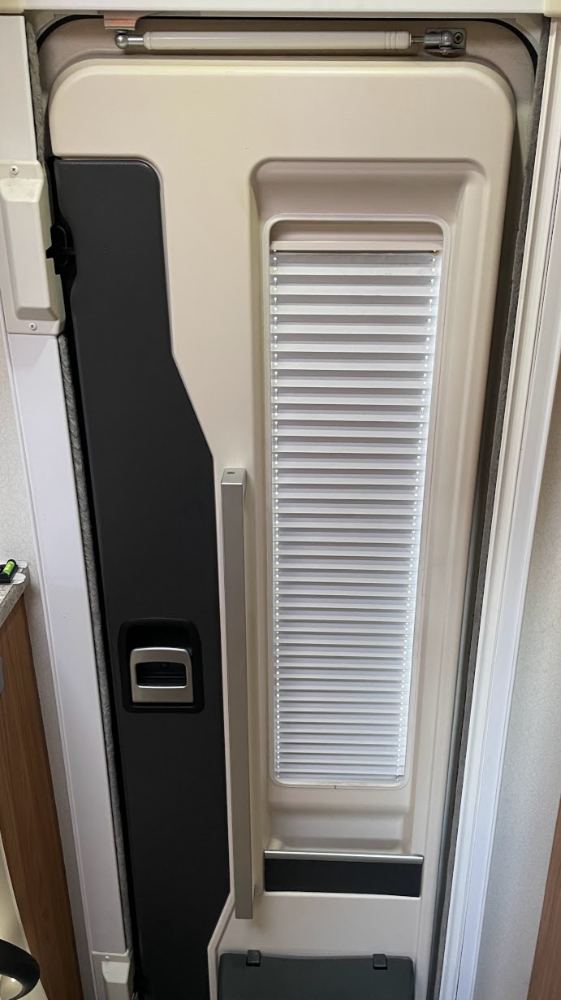

<link href="../styles/custom.css" rel="stylesheet" />
<link rel="stylesheet" href="https://cdn.jsdelivr.net/npm/bootstrap@4.6.1/dist/css/bootstrap.min.css" integrity="sha384-zCbKRCUGaJDkqS1kPbPd7TveP5iyJE0EjAuZQTgFLD2ylzuqKfdKlfG/eSrtxUkn" crossorigin="anonymous">

## Blinds and Flyscreens
All windows including the sunroof hatch, main entry door and cab has blackout blinds.

All windows has internal blackout blind and flyscreen set.

Sunroof hatch.

Main entry door.

Example of the door and windscreen bloackout blinds inside the cab. 

<a href="/#guides"><button class="nav-button"><i class="arrow arrow-left"></i> Back</button></a>

