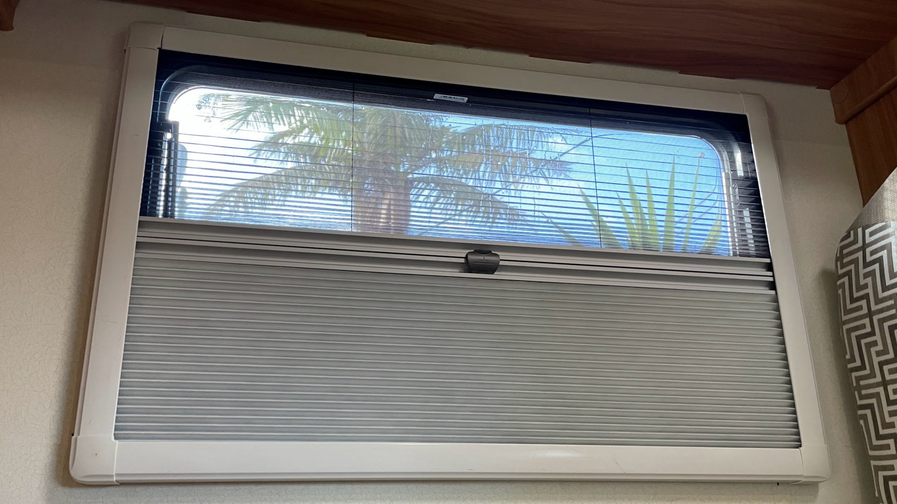
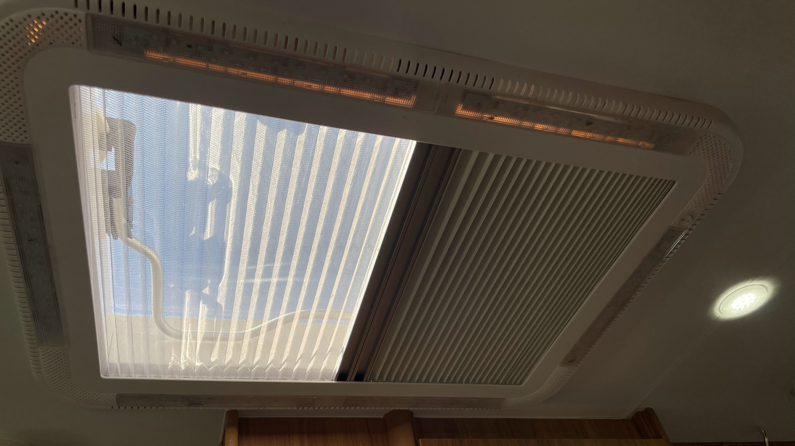
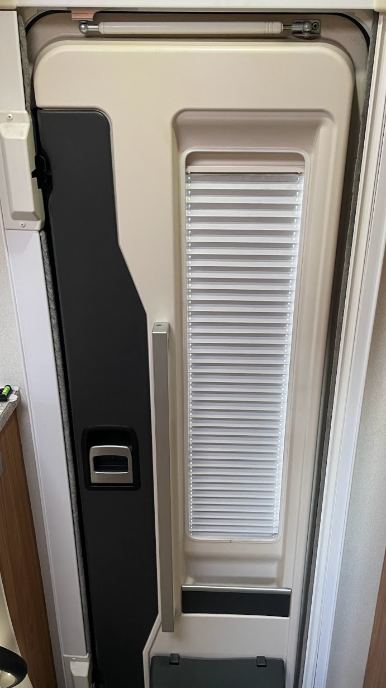
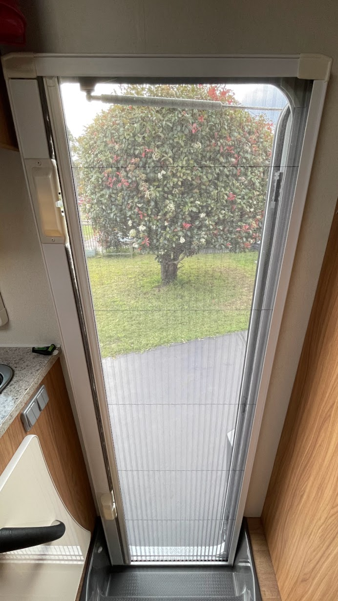
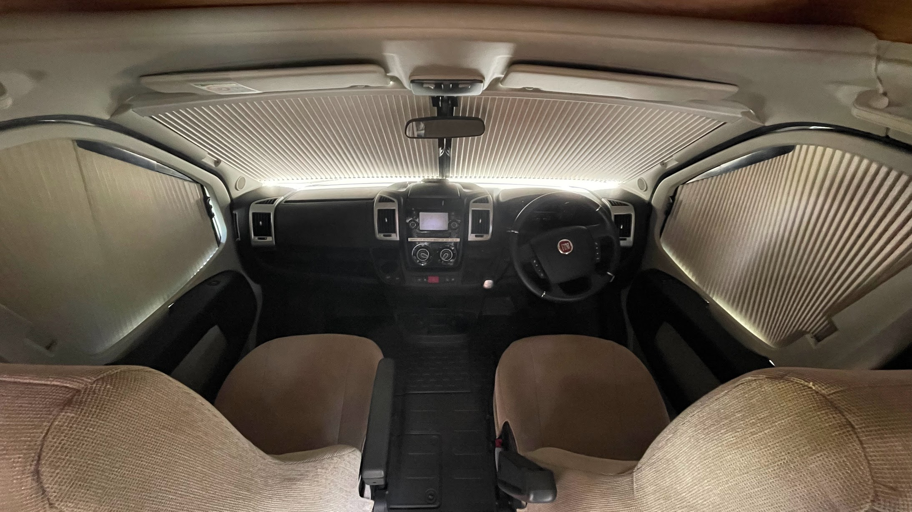

<link href="../styles/custom.css" rel="stylesheet" />
<link rel="stylesheet" href="https://cdn.jsdelivr.net/npm/bootstrap@4.6.1/dist/css/bootstrap.min.css" integrity="sha384-zCbKRCUGaJDkqS1kPbPd7TveP5iyJE0EjAuZQTgFLD2ylzuqKfdKlfG/eSrtxUkn" crossorigin="anonymous">

# Blinds and Flyscreens
All windows including the sunroof hatch, main entry door and cab has blackout blinds.

Example of window blind and flyscreen set.

Sunroof hatch.

Main entry door blinds.

Main entry door flyscreen.

    <svg class="svg-inline--fa fa-triangle-exclamation fa-w-16" aria-hidden="true" focusable="false" data-prefix="fas" data-icon="triangle-exclamation" role="img" xmlns="http://www.w3.org/2000/svg" viewBox="0 0 512 512"><path fill="currentColor" d="M506.3 417l-213.3-364c-16.33-28-57.54-28-73.98 0l-213.2 364C-10.59 444.9 9.849 480 42.74 480h426.6C502.1 480 522.6 445 506.3 417zM232 168c0-13.25 10.75-24 24-24S280 154.8 280 168v128c0 13.25-10.75 24-23.1 24S232 309.3 232 296V168zM256 416c-17.36 0-31.44-14.08-31.44-31.44c0-17.36 14.07-31.44 31.44-31.44s31.44 14.08 31.44 31.44C287.4 401.9 273.4 416 256 416z"/></svg>  
    <strong>Important:</strong> Do not close the main entry door when the flyscreen is shut as this can damage the flyscreen.

Example of the door and windscreen blinds inside the cab. 

<a href="/#guides"><button class="nav-button"><i class="arrow arrow-left"></i> Back</button></a>

