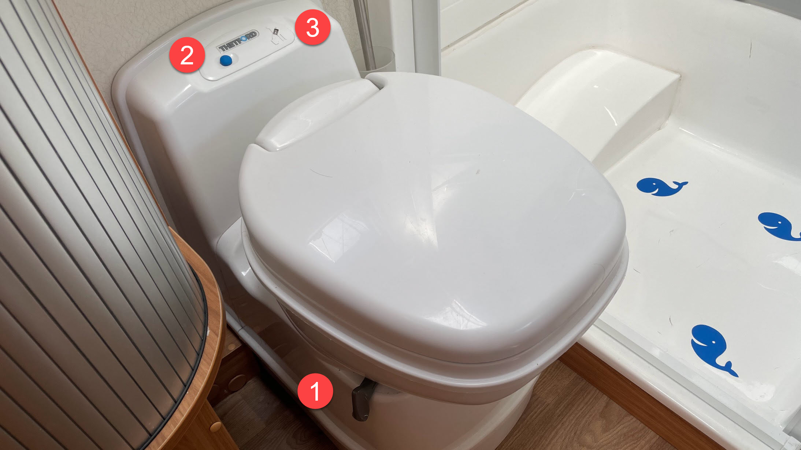
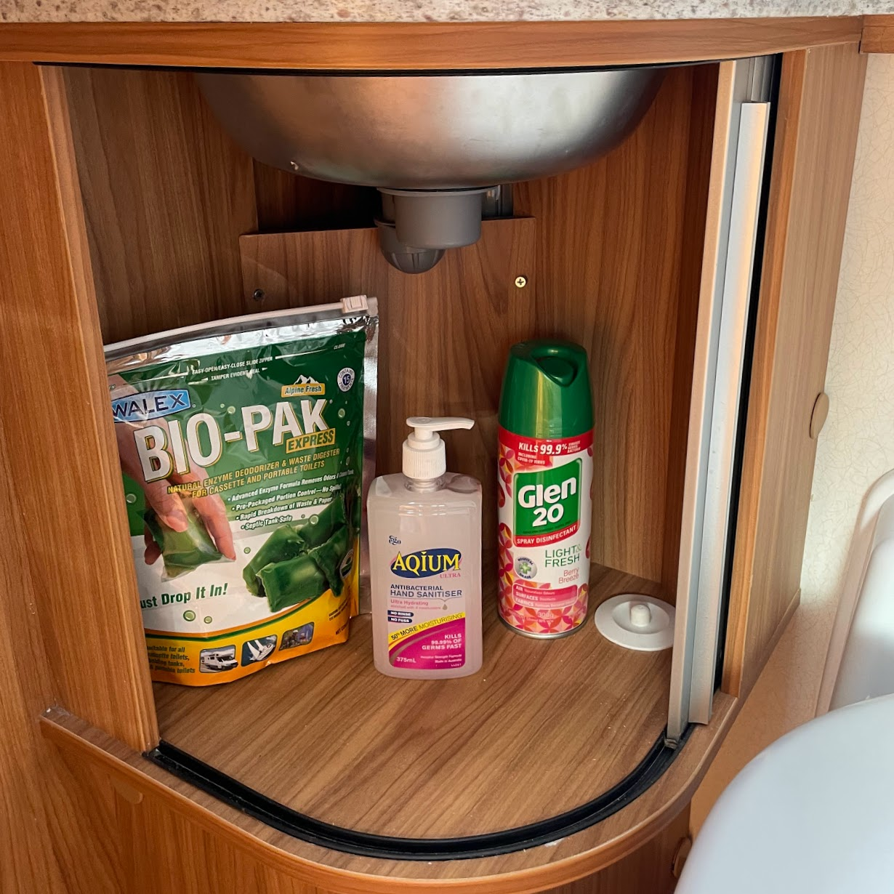
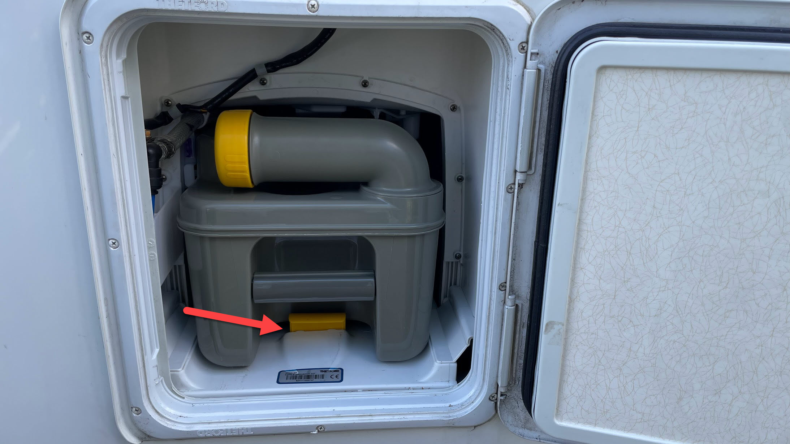
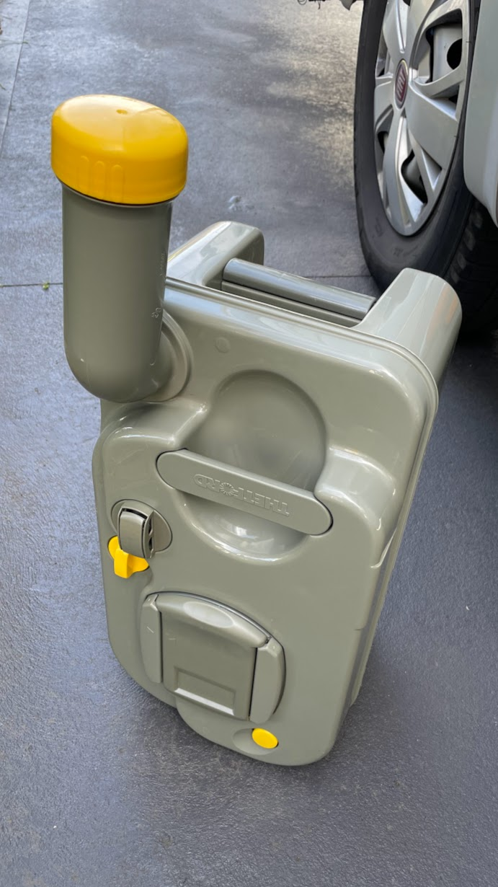

<link href="../styles/custom.css" rel="stylesheet" />
<link rel="stylesheet" href="https://cdn.jsdelivr.net/npm/bootstrap@4.6.1/dist/css/bootstrap.min.css" integrity="sha384-zCbKRCUGaJDkqS1kPbPd7TveP5iyJE0EjAuZQTgFLD2ylzuqKfdKlfG/eSrtxUkn" crossorigin="anonymous">

# Cassette Toilet
Lillen is equipped with a casette toilet that is made up of two parts: a permanently fixed toilet and a 
waste tank that is accessible from the outside.

The removable waste tank is located under the toilet and can be removed via an access door on the 
outside of the motor home.

## Toilet

1. Valve blade handle (open/close)
2. Flush button
3. Waste tank indicator. Awarning light illuminates when the waste tank requires emptying.

    <svg class="svg-inline--fa fa-triangle-exclamation fa-w-16" aria-hidden="true" focusable="false" data-prefix="fas" data-icon="triangle-exclamation" role="img" xmlns="http://www.w3.org/2000/svg" viewBox="0 0 512 512"><path fill="currentColor" d="M506.3 417l-213.3-364c-16.33-28-57.54-28-73.98 0l-213.2 364C-10.59 444.9 9.849 480 42.74 480h426.6C502.1 480 522.6 445 506.3 417zM232 168c0-13.25 10.75-24 24-24S280 154.8 280 168v128c0 13.25-10.75 24-23.1 24S232 309.3 232 296V168zM256 416c-17.36 0-31.44-14.08-31.44-31.44c0-17.36 14.07-31.44 31.44-31.44s31.44 14.08 31.44 31.44C287.4 401.9 273.4 416 256 416z"/></svg>  
    <strong>Warning:</strong> Do not use toilet when the waste tank indicator is lit.

    <svg class="svg-inline--fa fa-lightbulb fa-w-11" aria-hidden="true" focusable="false" data-prefix="fas" data-icon="lightbulb" role="img" xmlns="http://www.w3.org/2000/svg" viewBox="0 0 352 512" data-fa-i2svg=""><path fill="currentColor" d="M96.06 454.35c.01 6.29 1.87 12.45 5.36 17.69l17.09 25.69a31.99 31.99 0 0 0 26.64 14.28h61.71a31.99 31.99 0 0 0 26.64-14.28l17.09-25.69a31.989 31.989 0 0 0 5.36-17.69l.04-38.35H96.01l.05 38.35zM0 176c0 44.37 16.45 84.85 43.56 115.78 16.52 18.85 42.36 58.23 52.21 91.45.04.26.07.52.11.78h160.24c.04-.26.07-.51.11-.78 9.85-33.22 35.69-72.6 52.21-91.45C335.55 260.85 352 220.37 352 176 352 78.61 272.91-.3 175.45 0 73.44.31 0 82.97 0 176zm176-80c-44.11 0-80 35.89-80 80 0 8.84-7.16 16-16 16s-16-7.16-16-16c0-61.76 50.24-112 112-112 8.84 0 16 7.16 16 16s-7.16 16-16 16z"></path></svg>
    <strong>Tip:</strong> After closing the valve blade, gently flush for a thin layer of water that will prevent 
bad odour escaping the waste tank into the van.

## Waste Tank Treatment
Bio-Pak is provied and located in the cupboard under the bathroom sink. It is easy to use with no messy liquids and quickly breaks 
down waste, avoids unpleasant smells in the waste tank and keeps the inside of the waste tank clean. 

Before use, drop a one BIO-PAK packet into the toilet waste tank and flush until covered. 

## Waste Tank
Please follow below steps to empty the waste tank.

    <svg class="svg-inline--fa fa-lightbulb fa-w-11" aria-hidden="true" focusable="false" data-prefix="fas" data-icon="lightbulb" role="img" xmlns="http://www.w3.org/2000/svg" viewBox="0 0 352 512" data-fa-i2svg=""><path fill="currentColor" d="M96.06 454.35c.01 6.29 1.87 12.45 5.36 17.69l17.09 25.69a31.99 31.99 0 0 0 26.64 14.28h61.71a31.99 31.99 0 0 0 26.64-14.28l17.09-25.69a31.989 31.989 0 0 0 5.36-17.69l.04-38.35H96.01l.05 38.35zM0 176c0 44.37 16.45 84.85 43.56 115.78 16.52 18.85 42.36 58.23 52.21 91.45.04.26.07.52.11.78h160.24c.04-.26.07-.51.11-.78 9.85-33.22 35.69-72.6 52.21-91.45C335.55 260.85 352 220.37 352 176 352 78.61 272.91-.3 175.45 0 73.44.31 0 82.97 0 176zm176-80c-44.11 0-80 35.89-80 80 0 8.84-7.16 16-16 16s-16-7.16-16-16c0-61.76 50.24-112 112-112 8.84 0 16 7.16 16 16s-7.16 16-16 16z"></path></svg>
    <strong>Tip:</strong> Consider having hand sanitiser nearby.

1. Unlock the access door and open it.
2. Remove the waste tank by pulling the safety catch upwards.

3. Pull the waste tank outwards to the stop. Tip it slightly and take out the tank completely.
4. Place the tank upright and turn the emptying spout upwards.

5. Empty at designated dump point
6. Rinse out tank with fresh water 

    <svg class="svg-inline--fa fa-info-circle fa-w-16" aria-hidden="true" focusable="false" data-prefix="fas" data-icon="info-circle" role="img" xmlns="http://www.w3.org/2000/svg" viewBox="0 0 512 512" data-fa-i2svg=""><path fill="currentColor" d="M256 8C119.043 8 8 119.083 8 256c0 136.997 111.043 248 248 248s248-111.003 248-248C504 119.083 392.957 8 256 8zm0 110c23.196 0 42 18.804 42 42s-18.804 42-42 42-42-18.804-42-42 18.804-42 42-42zm56 254c0 6.627-5.373 12-12 12h-88c-6.627 0-12-5.373-12-12v-24c0-6.627 5.373-12 12-12h12v-64h-12c-6.627 0-12-5.373-12-12v-24c0-6.627 5.373-12 12-12h64c6.627 0 12 5.373 12 12v100h12c6.627 0 12 5.373 12 12v24z"></path></svg>
    <strong>Note:</strong> Rinse and repeat until water is clear.

7. Turn the emptying spout back to its original position. 
8. Slide the waste tank back into its original position via the access door.
9. Make sure that the waste tank is secured with the safety catch. 
10. Shut the access door and lock it.

## Video
A short video from the manufacturer that describes how to operate the [Cassette Toilet](../videos/cassette-toilet.md) is also available.

## Manual
The manufacturers operating manual is available as a [PDF download](/docs/cassette-toilet.pdf). 

<a href="/guides/#guides"><button class="nav-button"><i class="arrow arrow-left"></i> Back</button></a>

