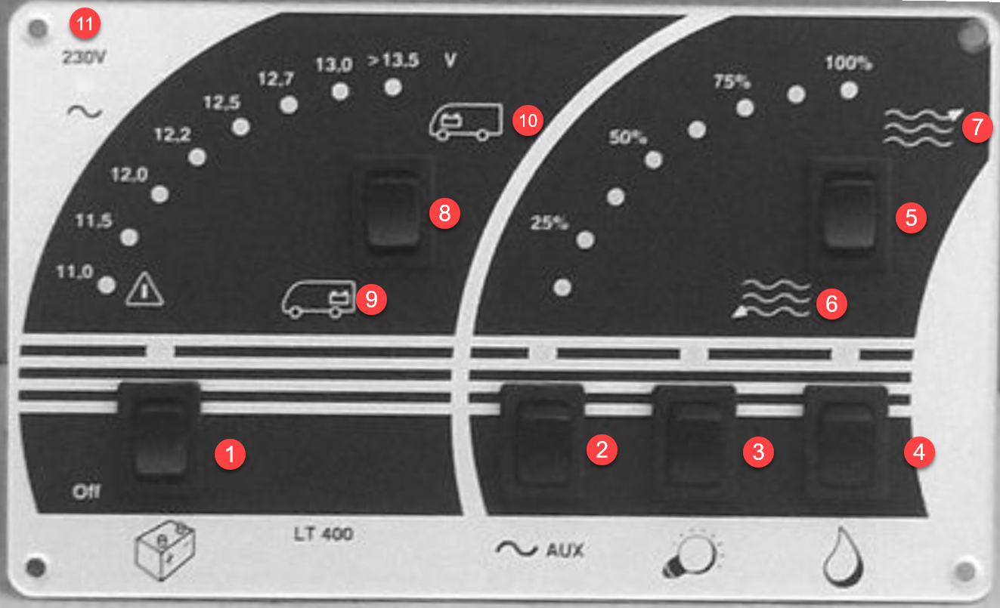

<link href="../styles/custom.css" rel="stylesheet" />

# Battery and Water Control Panel
The Battery and Water Control Panel is located near the main door. 

As a rule of thumb, while stationary button 1-4  should be switched ON.

>**Important!** All buttons must be switched **OFF** while driving.

##### LEGEND
1. Main battery button
2. Turns on auxiliary power. (Required for the powering the Bed, TV etc)
3. Enables the lighting
4. Turns on the water pump (Not required if connected to city water)
5. Checks the water tank levels
6. Grey water tank
7. Fresh water tank
8. Check the 12v battery power levels
9. The house battery
10. The car battery
11. Light indicating that external 240v electricity is operational