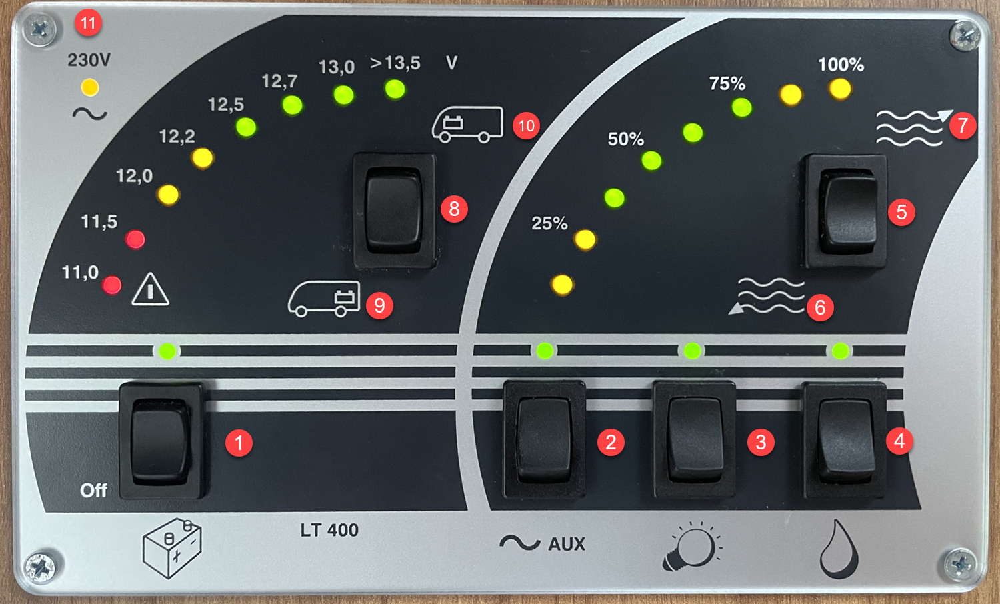

<link href="../styles/custom.css" rel="stylesheet" />
<link rel="stylesheet" href="https://cdn.jsdelivr.net/npm/bootstrap@4.6.1/dist/css/bootstrap.min.css" integrity="sha384-zCbKRCUGaJDkqS1kPbPd7TveP5iyJE0EjAuZQTgFLD2ylzuqKfdKlfG/eSrtxUkn" crossorigin="anonymous">

# Battery and Water Control Panel
The Battery and Water Control Panel is located near the main door. 

As a rule of thumb, while the vehicle is stationary, button 1-4 should be switched ON.

    <svg class="svg-inline--fa fa-triangle-exclamation fa-w-16" aria-hidden="true" focusable="false" data-prefix="fas" data-icon="triangle-exclamation" role="img" xmlns="http://www.w3.org/2000/svg" viewBox="0 0 512 512"><path fill="currentColor" d="M506.3 417l-213.3-364c-16.33-28-57.54-28-73.98 0l-213.2 364C-10.59 444.9 9.849 480 42.74 480h426.6C502.1 480 522.6 445 506.3 417zM232 168c0-13.25 10.75-24 24-24S280 154.8 280 168v128c0 13.25-10.75 24-23.1 24S232 309.3 232 296V168zM256 416c-17.36 0-31.44-14.08-31.44-31.44c0-17.36 14.07-31.44 31.44-31.44s31.44 14.08 31.44 31.44C287.4 401.9 273.4 416 256 416z"/></svg>  
    <strong>Warning:</strong> All buttons must be switched <b>OFF</b> while driving.

##### LEGEND
1. Main battery button
2. Turns on auxiliary power. (Required for the powering the Bed, TV etc)
3. Enables the lighting
4. Turns on the water pump (Not required if connected to city water)
5. Checks the water tank levels
6. Greywater tank
7. Fresh water tank
8. Check the 12V battery power levels
9. The house battery
10. The car battery
11. Light indicating that external 240V electricity is operational

<a href="/guides/#guides"><button class="nav-button"><i class="arrow arrow-left"></i> Back</button></a>

