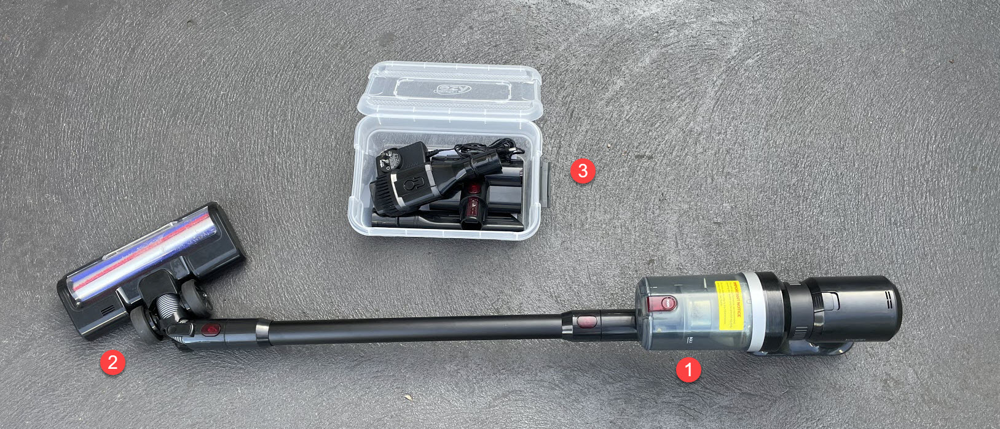
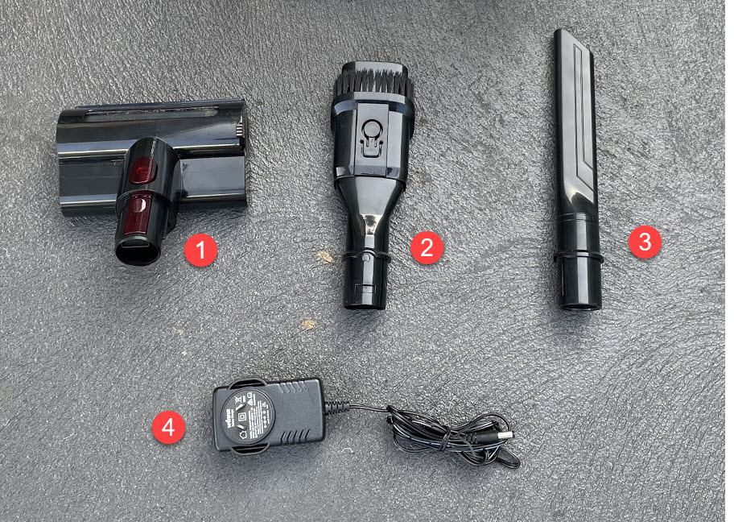

<link href="../styles/custom.css" rel="stylesheet" />

# Cordless Vacuum
A cordless vacuum with a chargable battery is kept in the left side rear storage compartment.

**Main features**
- Washable HEPA filter captures up to 99.97% of fine dust and allergens
- 3 Hours fast charging and up to 52 minutes running time
- 3 Power levels and 2 motorheads for a more comprehensive clean
- 500ml Dustbin with hygienic dirt ejector

1. Cordless Vacuum
2. 270&#xb0; Rotatable High Torque Brush with front LED lights
3. Accessories box

## Accessories

1. Mini Motorised Tool
2. Crevice Tool
3. Combination Tool
4. Charger

> Please note that to charge the vaccum access to 240V power is required.

<a href="/#guides"><button class="nav-button"><i class="arrow arrow-left"></i> Back</button></a>

