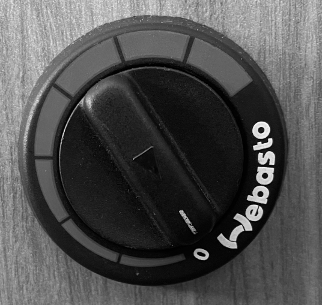

<link href="../styles/custom.css" rel="stylesheet" />

# Diesel Heater Control
Lillen is equipped with a diesel heater for those cold winter months. It is using the same diesel fuel tank 
as the Fiat engine. 

The diesel heater control is a dial that is located at the back of the motorhome on the left side next 
to the [hot water heater controls](hot-water-heater-controls.md).

To turn the heater on, simply turn the dial anti clockwise to the desired level.
Hot air will then blow out from under the wardrobe.

<a href="/#guides"><button class="nav-button"><i class="arrow arrow-left"></i> Back</button></a>

