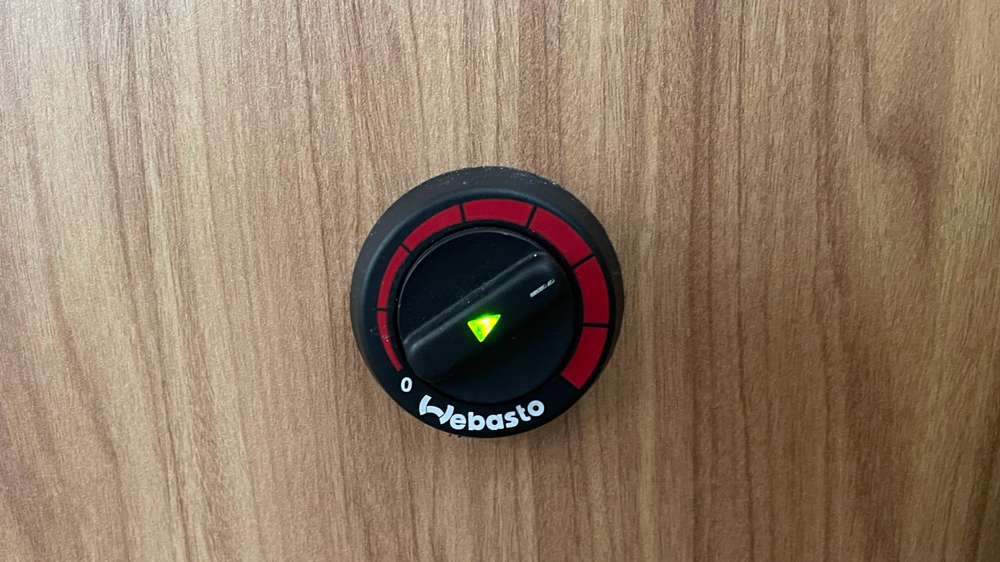
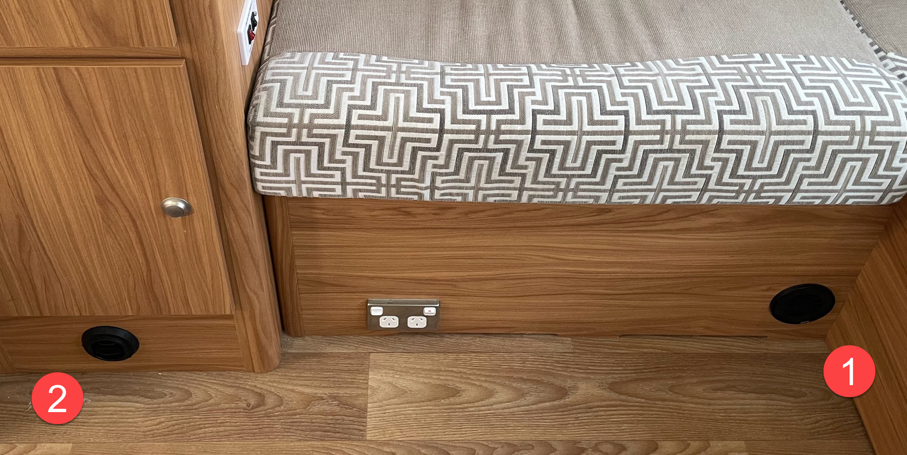

<link href="../styles/custom.css" rel="stylesheet" />
<link rel="stylesheet" href="https://cdn.jsdelivr.net/npm/bootstrap@4.6.1/dist/css/bootstrap.min.css" integrity="sha384-zCbKRCUGaJDkqS1kPbPd7TveP5iyJE0EjAuZQTgFLD2ylzuqKfdKlfG/eSrtxUkn" crossorigin="anonymous">

# Diesel Heater
Lillen is equipped with a diesel heater for use while the vehicle is stationary,
the diesel heater unit not only warms the RV's interior but also dehumidifies for complete comfort. 

    <svg class="svg-inline--fa fa-info-circle fa-w-16" aria-hidden="true" focusable="false" data-prefix="fas" data-icon="info-circle" role="img" xmlns="http://www.w3.org/2000/svg" viewBox="0 0 512 512" data-fa-i2svg=""><path fill="currentColor" d="M256 8C119.043 8 8 119.083 8 256c0 136.997 111.043 248 248 248s248-111.003 248-248C504 119.083 392.957 8 256 8zm0 110c23.196 0 42 18.804 42 42s-18.804 42-42 42-42-18.804-42-42 18.804-42 42-42zm56 254c0 6.627-5.373 12-12 12h-88c-6.627 0-12-5.373-12-12v-24c0-6.627 5.373-12 12-12h12v-64h-12c-6.627 0-12-5.373-12-12v-24c0-6.627 5.373-12 12-12h64c6.627 0 12 5.373 12 12v100h12c6.627 0 12 5.373 12 12v24z"></path></svg>
    <strong>Info:</strong> The heater would use approximately <b>1 litre of fuel</b> every 5-6 hours and is 
using the vehicle's normal diesel tank.

## Rotary Control
The diesel heater Rotary Control is located at the back of the motorhome on the left side next to the [hot water heater controls](hot-water-system.md).

### Start-up Sequence
The glow plug and the combustion air fan start the operation and combustion process 
(audible combustion sound of the combustion air fan and the ticking of the fuel pump will be noticeable). The fuel will be delivered and the combustion air fan speed will accelerate and provide hot air.

### Switching Off
When heating is no longer required, switch the heater off by the means of the controller on the heater.

The combustion will be extinguished, followed by a shutdown cooling cycle.

    <svg class="svg-inline--fa fa-triangle-exclamation fa-w-16" aria-hidden="true" focusable="false" data-prefix="fas" data-icon="triangle-exclamation" role="img" xmlns="http://www.w3.org/2000/svg" viewBox="0 0 512 512"><path fill="currentColor" d="M506.3 417l-213.3-364c-16.33-28-57.54-28-73.98 0l-213.2 364C-10.59 444.9 9.849 480 42.74 480h426.6C502.1 480 522.6 445 506.3 417zM232 168c0-13.25 10.75-24 24-24S280 154.8 280 168v128c0 13.25-10.75 24-23.1 24S232 309.3 232 296V168zM256 416c-17.36 0-31.44-14.08-31.44-31.44c0-17.36 14.07-31.44 31.44-31.44s31.44 14.08 31.44 31.44C287.4 401.9 273.4 416 256 416z"/></svg>  
    <strong>Important:</strong> Never turn the heater off by the main power supply.  

## Outlets
Keep return air inlet (1) and hot air outlet (2) free of obstructions to prevent the heater from overheating.

## Manual
The manufacturers operating manual is available as a [PDF download](/docs/diesel-heater.pdf). 

<a href="/#guides"><button class="nav-button"><i class="arrow arrow-left"></i> Back</button></a>

