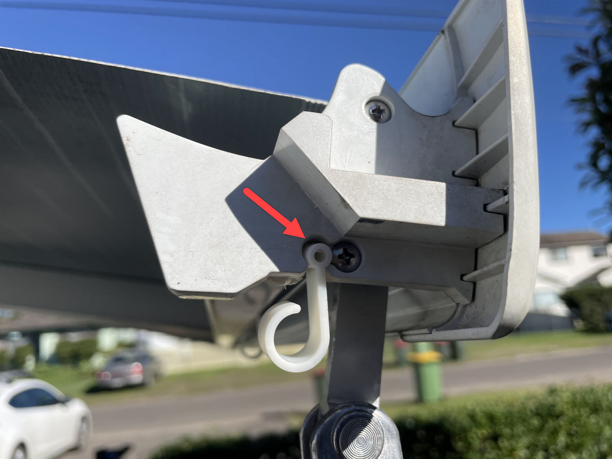

<link href="../styles/custom.css" rel="stylesheet" />
<link rel="stylesheet" href="https://cdn.jsdelivr.net/npm/bootstrap@4.6.1/dist/css/bootstrap.min.css" integrity="sha384-zCbKRCUGaJDkqS1kPbPd7TveP5iyJE0EjAuZQTgFLD2ylzuqKfdKlfG/eSrtxUkn" crossorigin="anonymous">

# Festoon Lights
Lillen has festoon lights that can be hung from the awning using the provided track 
hanger clips. 

    <svg class="svg-inline--fa fa-info-circle fa-w-16" aria-hidden="true" focusable="false" data-prefix="fas" data-icon="info-circle" role="img" xmlns="http://www.w3.org/2000/svg" viewBox="0 0 512 512" data-fa-i2svg=""><path fill="currentColor" d="M256 8C119.043 8 8 119.083 8 256c0 136.997 111.043 248 248 248s248-111.003 248-248C504 119.083 392.957 8 256 8zm0 110c23.196 0 42 18.804 42 42s-18.804 42-42 42-42-18.804-42-42 18.804-42 42-42zm56 254c0 6.627-5.373 12-12 12h-88c-6.627 0-12-5.373-12-12v-24c0-6.627 5.373-12 12-12h12v-64h-12c-6.627 0-12-5.373-12-12v-24c0-6.627 5.373-12 12-12h64c6.627 0 12 5.373 12 12v100h12c6.627 0 12 5.373 12 12v24z"></path></svg>
    <strong>Note:</strong> The Feston Lights need 240V to operate

## Connect the Clips
Start by sliding 5-6 awning track hanger clips into the awning track.

## Hang the Festoon Lights
Hang the lights starting with the first light bulb from the rear end of 
the awning and double back when reaching the front of the van.

## Wrap the Power Cord
With the rear awning leg attached to the side wall 
wrap the power cord around the leg and then go across 
to the external power point under the kitchen window.

## Storage
The festoon lights and a provided awning track hanger clips 
are kept in a box in the left side rear storage compartment.

<a href="/#guides"><button class="nav-button"><i class="arrow arrow-left"></i> Back</button></a>

