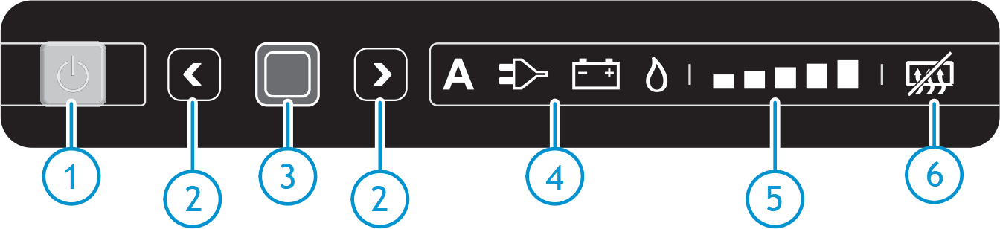

<link href="../styles/custom.css" rel="stylesheet" />
<link rel="stylesheet" href="https://cdn.jsdelivr.net/npm/bootstrap@4.6.1/dist/css/bootstrap.min.css" integrity="sha384-zCbKRCUGaJDkqS1kPbPd7TveP5iyJE0EjAuZQTgFLD2ylzuqKfdKlfG/eSrtxUkn" crossorigin="anonymous">

# Fridge
Lillen has a 3-way refrigerator that has 3 modes of operation that is specially developed for caravans or motorhomes.

## Measurements

| Cabinet | Volume | Width | Height | Depth |
|---|---|---|---|---|
| Fridge | **148** Liters | 43cm | 80cm | 43cm |
| Freezer | **29** Liters | 38cm | 25cm | 30cm |
| **TOTAL** | **177** Liters |

## Control Panel

1. On/Off switch
2. Arrow Buttons
3. Confirmation Button
4. Sources
5. Cooling level indicators
6. Anti-condensation 

## Modes

### Auto mode
The refrigerator automatically selects the best source available (in order, mains, battery, LP gas. This is recommended. 

It is possible to override the automatic source selection by selecting one of the energy sources manually.

### 240V electricity
Use mains power if connected to external power.

### LP gas
Use LP gas if there is no access to external power.

When selecting LP gas, the flame should be ignited within 30 seconds. If the system fails, restart the refrigerator and select the LP gas source again.

    <svg class="svg-inline--fa fa-triangle-exclamation fa-w-16" aria-hidden="true" focusable="false" data-prefix="fas" data-icon="triangle-exclamation" role="img" xmlns="http://www.w3.org/2000/svg" viewBox="0 0 512 512"><path fill="currentColor" d="M506.3 417l-213.3-364c-16.33-28-57.54-28-73.98 0l-213.2 364C-10.59 444.9 9.849 480 42.74 480h426.6C502.1 480 522.6 445 506.3 417zM232 168c0-13.25 10.75-24 24-24S280 154.8 280 168v128c0 13.25-10.75 24-23.1 24S232 309.3 232 296V168zM256 416c-17.36 0-31.44-14.08-31.44-31.44c0-17.36 14.07-31.44 31.44-31.44s31.44 14.08 31.44 31.44C287.4 401.9 273.4 416 256 416z"/></svg>  
    <strong>Important:</strong> Do not operate your refrigerator on LP gas while driving.

    <strong>Info:</strong> For safety reasons it is not possible to ignite the flame within <b>15 minutes</b> after driving.

    <strong>Info:</strong> The refrigerator must be completely level and will not operate if not parked on a <b>flat surface</b>.

### 12V electricity

    <strong>Info:</strong> 12v will only operate whilst driving. 

### Fans
There are two fans at the rear of the refrigerator to improve the cooling performance in high temperatures. 
It helps to detract the warm air quicker to the vents. 

Fan **level 1** is to be used at ambient temperatures above **32C**  
Fan **level 2** is to be used at ambient temperatures above **38C**

## Video
A short video from the manufacturer that describes how to operate the [Fridge](/videos/fridge.md) is also available 

## Manual
The manufacturers operating manual is available as a [PDF download](/docs/fridge.pdf). 

<a href="/#guides"><button class="nav-button"><i class="arrow arrow-left"></i> Back</button></a>

