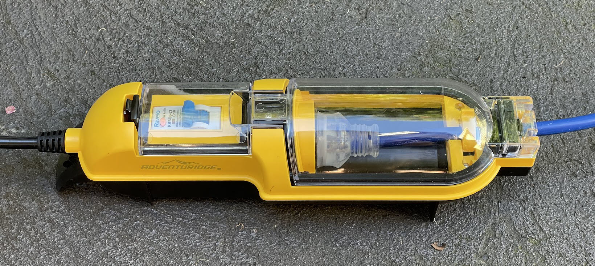

<link href="../styles/custom.css" rel="stylesheet" />
<link rel="stylesheet" href="https://cdn.jsdelivr.net/npm/bootstrap@4.6.1/dist/css/bootstrap.min.css" integrity="sha384-zCbKRCUGaJDkqS1kPbPd7TveP5iyJE0EjAuZQTgFLD2ylzuqKfdKlfG/eSrtxUkn" crossorigin="anonymous">

# Water Hoses and Power Cables
Lillen comes equipped with a drink water hose, grey water hose, a 15A extension cable and a 10A to 15A power adaptor.

## Drink Water Hose
The drink water hose is stored in a carrier bag togheter with a **12mm universal tap adaptor** (1). 

Please use the **12mm two way coupling** to connect the hose ends as pictured below (2) prior to storage to prevent 
any residual water from leaking.

## Grey Water Hose
The grey water hose is stored in a carrier bag. 

    <svg class="svg-inline--fa fa-triangle-exclamation fa-w-16" aria-hidden="true" focusable="false" data-prefix="fas" data-icon="triangle-exclamation" role="img" xmlns="http://www.w3.org/2000/svg" viewBox="0 0 512 512"><path fill="currentColor" d="M506.3 417l-213.3-364c-16.33-28-57.54-28-73.98 0l-213.2 364C-10.59 444.9 9.849 480 42.74 480h426.6C502.1 480 522.6 445 506.3 417zM232 168c0-13.25 10.75-24 24-24S280 154.8 280 168v128c0 13.25-10.75 24-23.1 24S232 309.3 232 296V168zM256 416c-17.36 0-31.44-14.08-31.44-31.44c0-17.36 14.07-31.44 31.44-31.44s31.44 14.08 31.44 31.44C287.4 401.9 273.4 416 256 416z"/></svg>  
    <strong>Important:</strong> Connect the hose ends as pictured below prior to storage to prevent any residual grey water from leaking.

## 15A Extension Cable
A 15 meter 15A Extension Cable is stored in a carrier bag togheter 
with a **Weatherproof Connector Protector** (1). 

### Weatherproof Connector Protector
If the extension cable is required, please use the weatherproof connector protector.

## 15A to 10A Power Adaptor
Use the included weatherproof 15A to 10A power adaptor to safely and legally 
connect the 15A power cable to 10A power point.

Generally, if you book a powered site at a caravan park it will be equipped with a 15A power point. 

However, if you are taking Lillen to stay at someones property they might only have 10A power points. 

## Storage
All water hose and power cable carrier bags are stored inside the right side rear storage 
compartment together with the weatherproof 15A to 10A power adaptor.

<a href="/guides/#guides"><button class="nav-button"><i class="arrow arrow-left"></i> Back</button></a>

