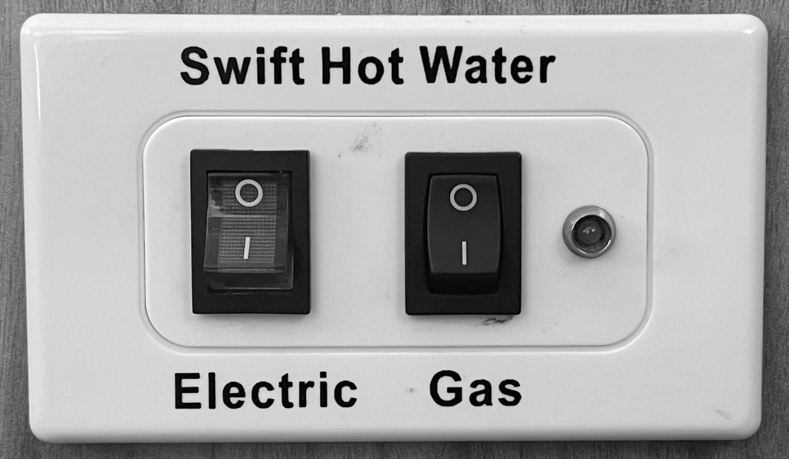

<link href="../styles/custom.css" rel="stylesheet" />

# Hot Water Heater Controls
The hot water controls are located at the back of the motorhome on the left side next to 
the [diesel heater control](diesel-heater-control.md).

## Electric
When connected to 240V external power use the left electric button. The whole button is lit when the hot water heater is operating on 240V.

## Gas
If no access to external power, then use the right Gas button. The light to the right of the button indicates that the hot water heater is operating on LPG Gas.

<a href="/#guides"><button class="nav-button"><i class="arrow arrow-left"></i> Back</button></a>
