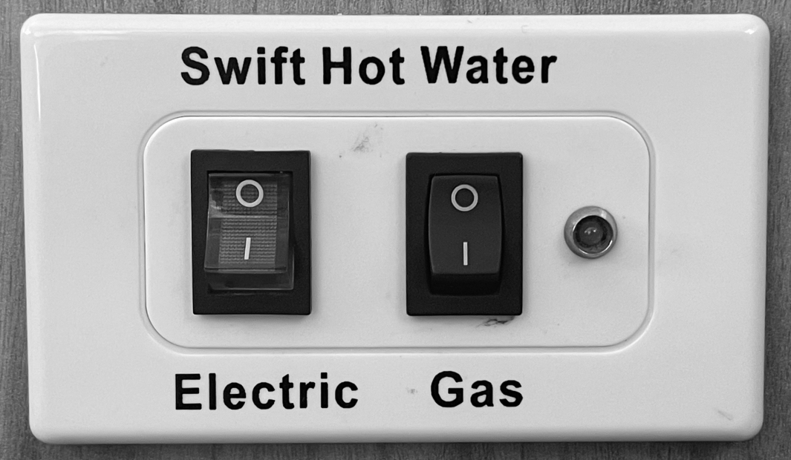

<link href="../styles/custom.css" rel="stylesheet" />
<link rel="stylesheet" href="https://cdn.jsdelivr.net/npm/bootstrap@4.6.1/dist/css/bootstrap.min.css" integrity="sha384-zCbKRCUGaJDkqS1kPbPd7TveP5iyJE0EjAuZQTgFLD2ylzuqKfdKlfG/eSrtxUkn" crossorigin="anonymous">

# Hot Water System
Lillen has a 28 Liter Dual (Gas & Electric) Hot Water System. 

This is enough capacity for a **6 minute hot shower**. 

## Controls
The hot water controls are located at the back of the motorhome on the left side next to 
the [diesel heater control](diesel-heater.md).

    <svg class="svg-inline--fa fa-lightbulb fa-w-11" aria-hidden="true" focusable="false" data-prefix="fas" data-icon="lightbulb" role="img" xmlns="http://www.w3.org/2000/svg" viewBox="0 0 352 512" data-fa-i2svg=""><path fill="currentColor" d="M96.06 454.35c.01 6.29 1.87 12.45 5.36 17.69l17.09 25.69a31.99 31.99 0 0 0 26.64 14.28h61.71a31.99 31.99 0 0 0 26.64-14.28l17.09-25.69a31.989 31.989 0 0 0 5.36-17.69l.04-38.35H96.01l.05 38.35zM0 176c0 44.37 16.45 84.85 43.56 115.78 16.52 18.85 42.36 58.23 52.21 91.45.04.26.07.52.11.78h160.24c.04-.26.07-.51.11-.78 9.85-33.22 35.69-72.6 52.21-91.45C335.55 260.85 352 220.37 352 176 352 78.61 272.91-.3 175.45 0 73.44.31 0 82.97 0 176zm176-80c-44.11 0-80 35.89-80 80 0 8.84-7.16 16-16 16s-16-7.16-16-16c0-61.76 50.24-112 112-112 8.84 0 16 7.16 16 16s-7.16 16-16 16z"></path></svg>
    <strong>Tip:</strong> Running both the gas and the electric at the same time will heat the water quicker.

### Electric
When connected to 240V external power use the left electric button. The whole button is lit when the hot water heater is operating on 240V.

It will reach a usable temperature in approximately 40 minutes and **full temperature in 1 hour**.

### Gas
Turn on the gas switch and the  light will flash rapidly until the gas lights. 

The light will then remain constant, If the gas fails to light or the gas bottle has 
been changed the system may have air in the line so the it is designed to repeat three times to
ensure that the flame sensor monitors the gas correctly. 

If the gas fails or it senses a fault in the system it will turn off the gas and the
light will flash at a constant rate until the switch is turned off to reset the unit.

## Manual
The manufacturers operating instructions is available as a [PDF download](/docs/hot-water-system.pdf). 

<a href="/#guides"><button class="nav-button"><i class="arrow arrow-left"></i> Back</button></a>

