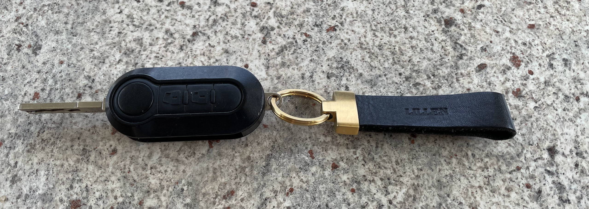

<link href="../styles/custom.css" rel="stylesheet" />

# Keys
Lillen has several keys for the various locks.

## Large Black Key with Remote (#C265)
Main key, used to start the engine and also the diesel fuel lock.

## Keyring

### 1 - Large Black Key (#C265)
Backup key, used to start the engine and also the diesel fuel lock.

### 2 - Medium Black Key 
Is used for the 
- Lift side entry door
- Left side rear storage compartment
- LPG gas bottle storage compartment
- Water tank lock

### 3 - Small Black Key (#9015)
Is used for the right side rear storage compartment.

### 4 - Small Black Key (#9004)
Is for the toilet cassette compartment.

### 5 - Small Silver Key (#CH751)
Is for the external shower.

<a href="/#guides"><button class="nav-button"><i class="arrow arrow-left"></i> Back</button></a>
