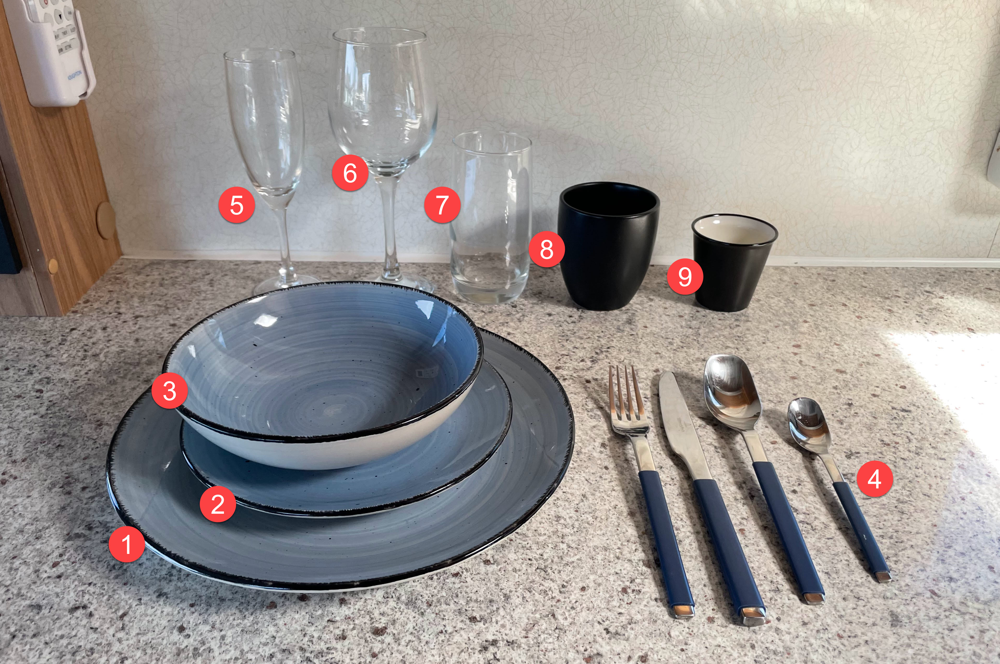
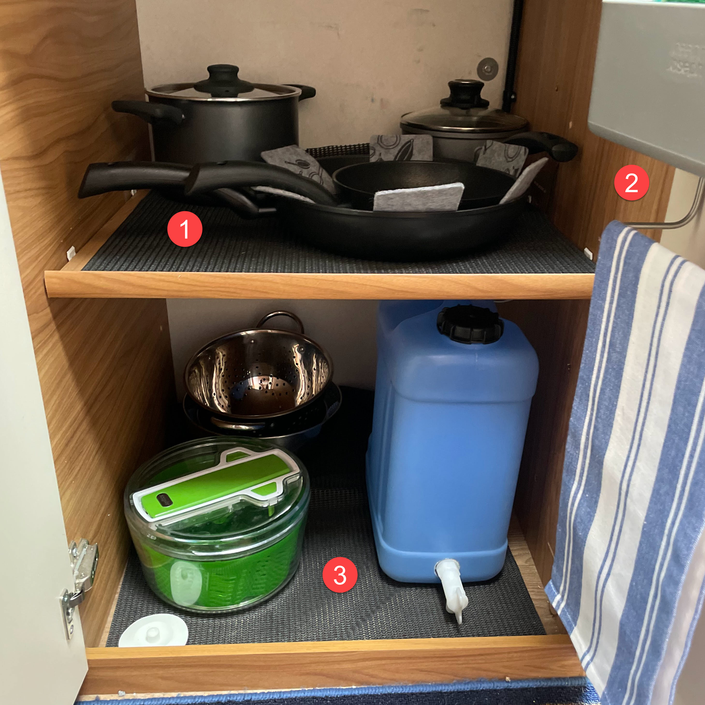
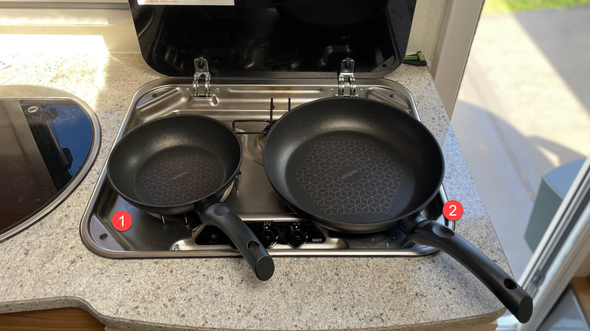
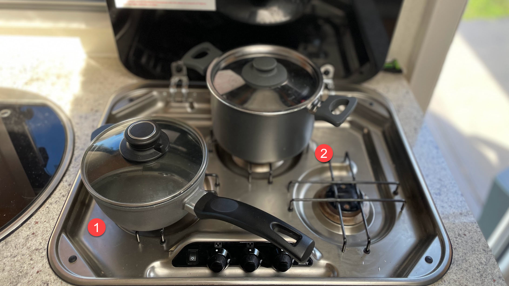
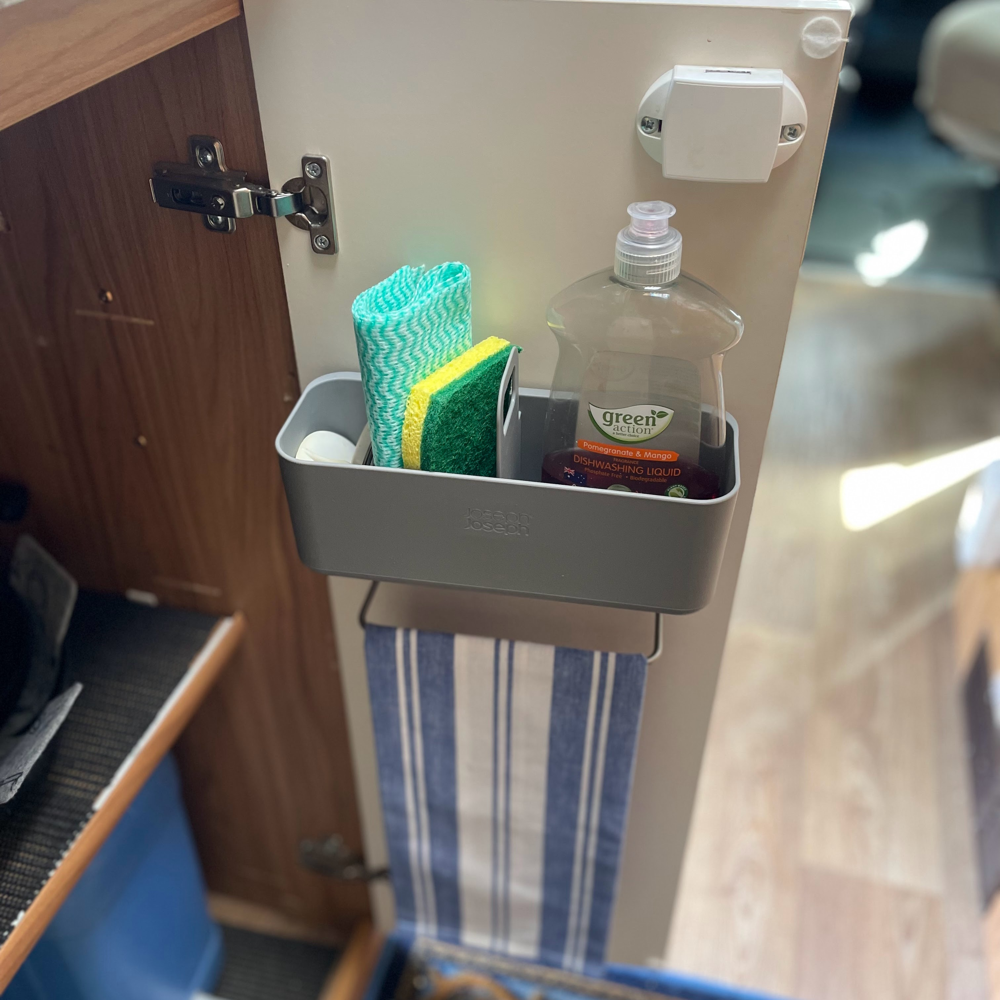
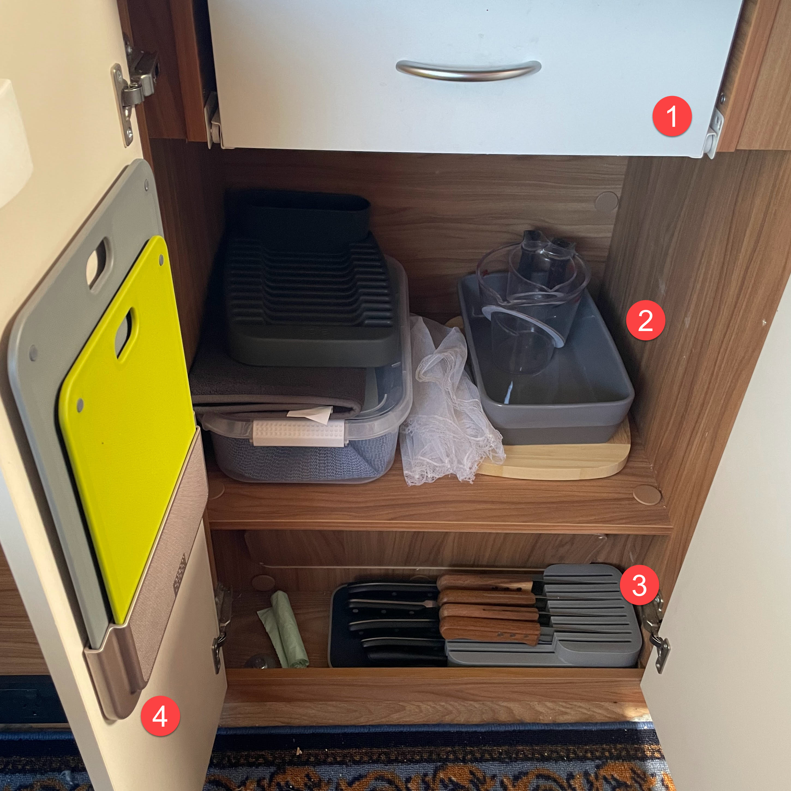
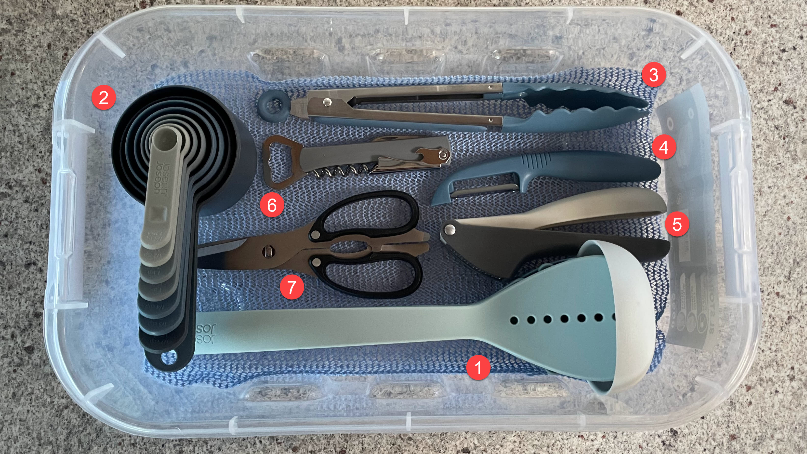
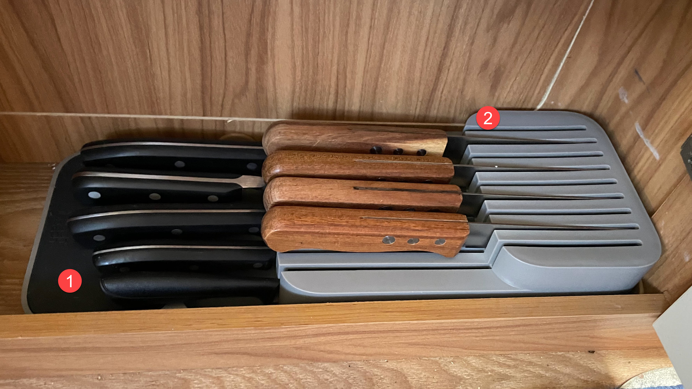
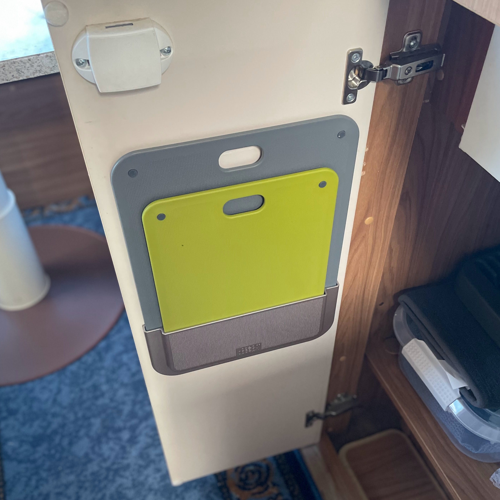
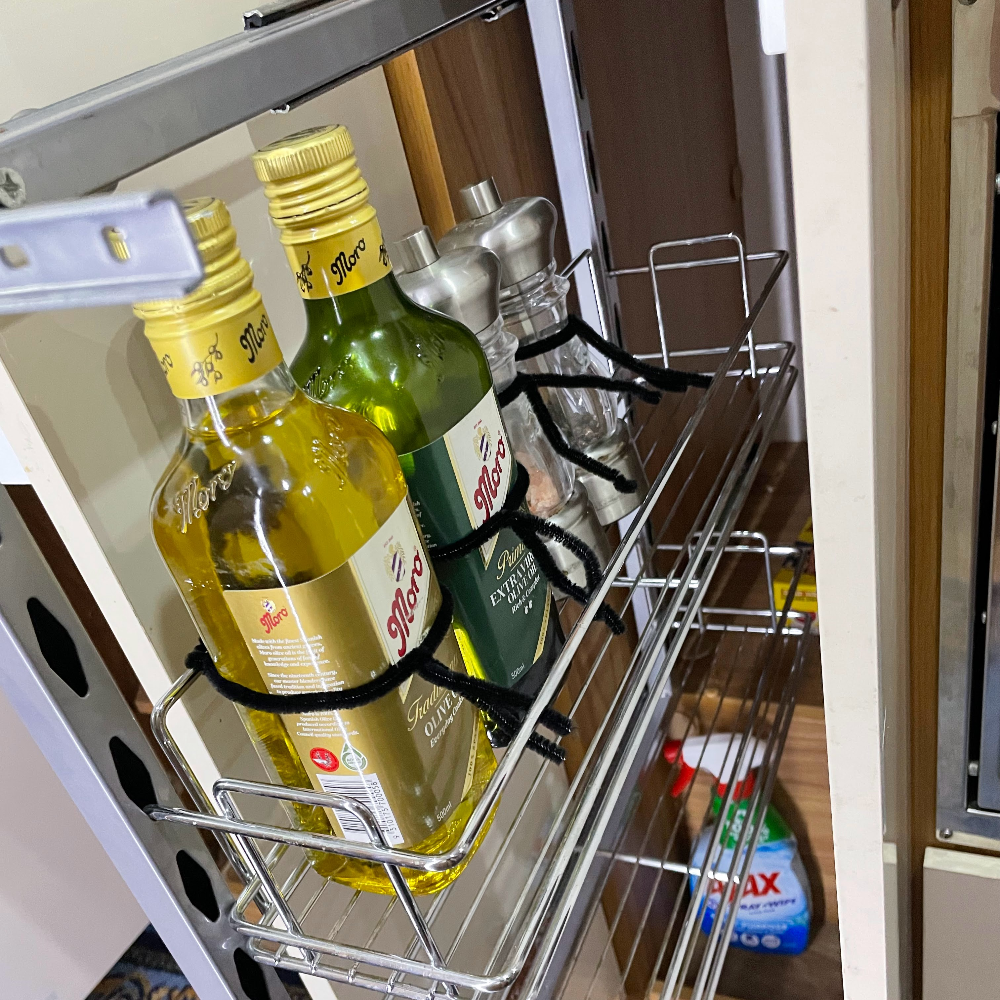

<link href="../styles/custom.css" rel="stylesheet" />
<link rel="stylesheet" href="https://cdn.jsdelivr.net/npm/bootstrap@4.6.1/dist/css/bootstrap.min.css" integrity="sha384-zCbKRCUGaJDkqS1kPbPd7TveP5iyJE0EjAuZQTgFLD2ylzuqKfdKlfG/eSrtxUkn" crossorigin="anonymous">

# Kitchenware
Lillen comes equipped with a tableware and cookware to cook for four people.

## Tableware
Lillen has four sets of tabelware that are stored in the cabines above the kitchen bench.

1. Dinner plates (26cm)
2. Side plate (19cm)
3. Small bowls (17cm)
4. Cutlery
5. Champagne Flutes
6. Wine Glasses
7. Hiball Glasses
8. Latte Mugs
9. Espresso Cups

## Cookware

### Right Cupboard
The cupboard to the left of the oven contains.

1. Pots and Pans
2. Sink Tidy
3. Drinking Water Jerry Can, Salad Spinner,  Colander and Two Salad Bowls.

#### Frypans
1. Open Skillet Frypan 20cm
2. Open Skillet Frypan 28cm

#### Pots
1. Covered Saucepan 17cm
2. Covered Stockpot 20cm

#### Sink Tidy
A handy removable caddy is provided with dishwashing liquid, sponge and a tea towel.

### Left Cupboard
The cupboard to the left of the oven contains.

1. Cuttlery drawer
2. Utensil storage
3. Knife block
4. Chopping Boards

#### Utensils
1. Utensil set including slotted spatula, spaghetti server, slotted spoon, solid spoon and ladle
2. Cup set with 8 different cup sizes ranging from &#188; tsp (1.25ml) up to 1 cup (250ml)
3. Lockable Tongs
4. Peeler
5. Garlic Press
6. Multi-purpose Bottle Opener
7. Kitchen Shears

#### Knife Block
1. Knive set incl Chef's, Bread, Utility and Paring Knife
2. Four Steak Knifes

#### Chopping Board Set
A large and small chopping board is located on the inside of a door.

### Pantry
Lillen has a small pantry nexted to the oven that comes provided with with Oils, Salt & Pepper.

 

<a href="/#guides"><button class="nav-button"><i class="arrow arrow-left"></i> Back</button></a>

