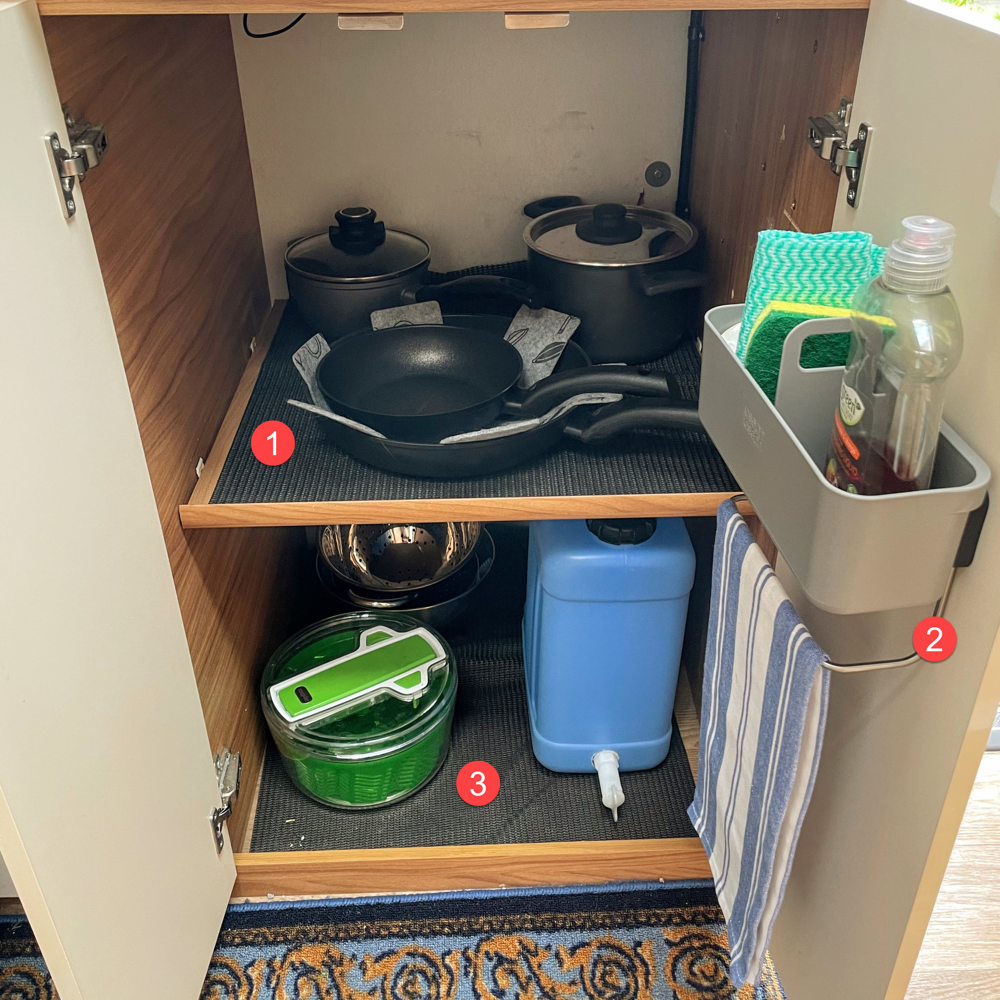
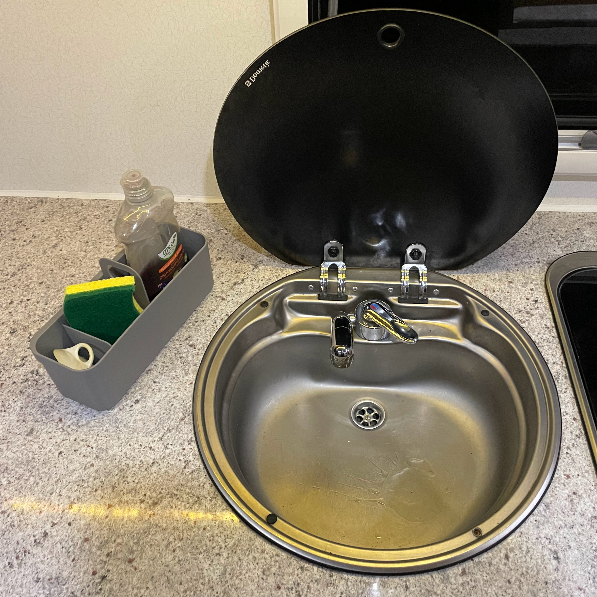
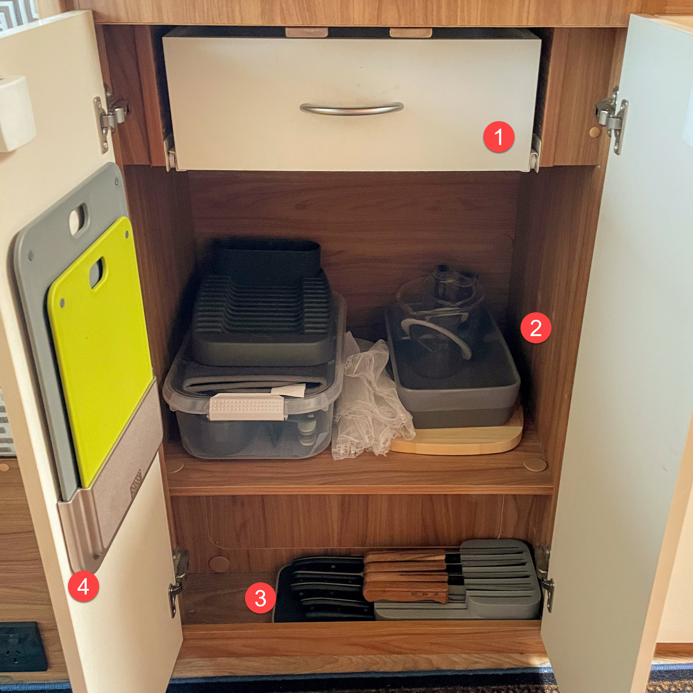

<link href="../styles/custom.css" rel="stylesheet" />
<link rel="stylesheet" href="https://cdn.jsdelivr.net/npm/bootstrap@4.6.1/dist/css/bootstrap.min.css" integrity="sha384-zCbKRCUGaJDkqS1kPbPd7TveP5iyJE0EjAuZQTgFLD2ylzuqKfdKlfG/eSrtxUkn" crossorigin="anonymous">

# Kitchenware
Lillen comes equipped with a tableware and cookware to cook for four people.

## Tableware
Lillen has four sets of tabelware that are stored in the cabines above the kitchen bench.

1. Dinner plates (26cm)
2. Side plate (19cm)
3. Small bowls (17cm)
4. Cutlery
5. Champagne Flutes
6. Wine Glasses
7. Hiball Glasses
8. Latte Mugs
9. Espresso Cups

## Cookware

### Right Cupboard
The cupboard to the right of the oven contains.

    <svg class="svg-inline--fa fa-info-circle fa-w-16" aria-hidden="true" focusable="false" data-prefix="fas" data-icon="info-circle" role="img" xmlns="http://www.w3.org/2000/svg" viewBox="0 0 512 512" data-fa-i2svg=""><path fill="currentColor" d="M256 8C119.043 8 8 119.083 8 256c0 136.997 111.043 248 248 248s248-111.003 248-248C504 119.083 392.957 8 256 8zm0 110c23.196 0 42 18.804 42 42s-18.804 42-42 42-42-18.804-42-42 18.804-42 42-42zm56 254c0 6.627-5.373 12-12 12h-88c-6.627 0-12-5.373-12-12v-24c0-6.627 5.373-12 12-12h12v-64h-12c-6.627 0-12-5.373-12-12v-24c0-6.627 5.373-12 12-12h64c6.627 0 12 5.373 12 12v100h12c6.627 0 12 5.373 12 12v24z"></path></svg>
    <strong>Note:</strong> A Drinking Water Jerry Can is provided as it is not recommeded to drink the water 
from the taps.

1. Pots and Pans
2. Sink Tidy
3. Drinking Water Jerry Can, Salad Spinner,  Colander and Two Salad Bowls.

#### Frypans
1. Open Skillet Frypan 20cm
2. Open Skillet Frypan 28cm

#### Pots
1. Covered Saucepan 17cm
2. Covered Stockpot 20cm

#### Sink Tidy
A handy removable caddy is provided with dishwashing liquid, sponge, extra bin liners and a tea towel.

    <svg class="svg-inline--fa fa-lightbulb fa-w-11" aria-hidden="true" focusable="false" data-prefix="fas" data-icon="lightbulb" role="img" xmlns="http://www.w3.org/2000/svg" viewBox="0 0 352 512" data-fa-i2svg=""><path fill="currentColor" d="M96.06 454.35c.01 6.29 1.87 12.45 5.36 17.69l17.09 25.69a31.99 31.99 0 0 0 26.64 14.28h61.71a31.99 31.99 0 0 0 26.64-14.28l17.09-25.69a31.989 31.989 0 0 0 5.36-17.69l.04-38.35H96.01l.05 38.35zM0 176c0 44.37 16.45 84.85 43.56 115.78 16.52 18.85 42.36 58.23 52.21 91.45.04.26.07.52.11.78h160.24c.04-.26.07-.51.11-.78 9.85-33.22 35.69-72.6 52.21-91.45C335.55 260.85 352 220.37 352 176 352 78.61 272.91-.3 175.45 0 73.44.31 0 82.97 0 176zm176-80c-44.11 0-80 35.89-80 80 0 8.84-7.16 16-16 16s-16-7.16-16-16c0-61.76 50.24-112 112-112 8.84 0 16 7.16 16 16s-7.16 16-16 16z"></path></svg>
    <strong>Tip:</strong> The caddy is removable

### Left Cupboard
The cupboard to the left of the oven contains.

1. Cuttlery Drawer
2. Utensil Storage, Drying Rack, Cutting Board, Baking Dish, Two Measuring Jugs (1 Cup and 4 Cups) and two Umbrella Food Covers.
3. Knife Block
4. Chopping Boards

#### Utensils
1. Utensil set including slotted spatula, spaghetti server, slotted spoon, solid spoon and ladle
2. Cup set with 8 different cup sizes ranging from &#188; tsp (1.25ml) up to 1 cup (250ml)
3. Lockable Tongs
4. Peeler
5. Garlic Press
6. Multi-purpose Bottle Opener
7. Kitchen Shears

#### Knife Block
1. Knive set incl Chef's, Bread, Utility and Paring Knife
2. Four Steak Knifes

#### Chopping Board Set
A large and small chopping board is located on the inside of a door.

### Pantry
Lillen has a small pantry nexted to the oven that comes provided with 
- Olive Oil
- Extra Virgin Olive Oil
- Salt & Pepper Mills
- Cling Wrap
- Aluminium Foil
- Baking Paper

 

<a href="/guides/#guides"><button class="nav-button"><i class="arrow arrow-left"></i> Back</button></a>

