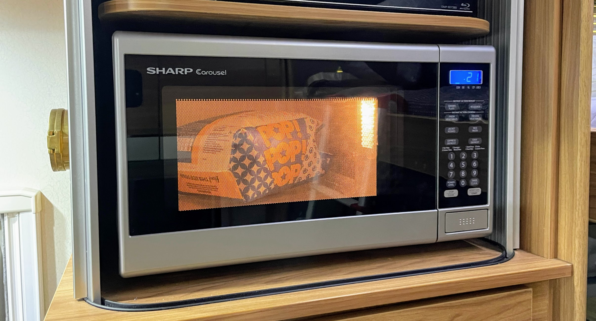
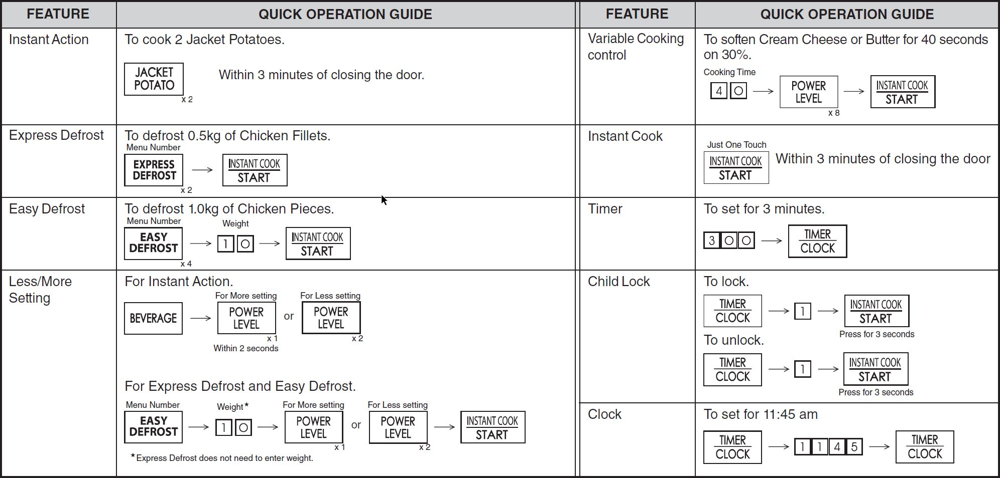
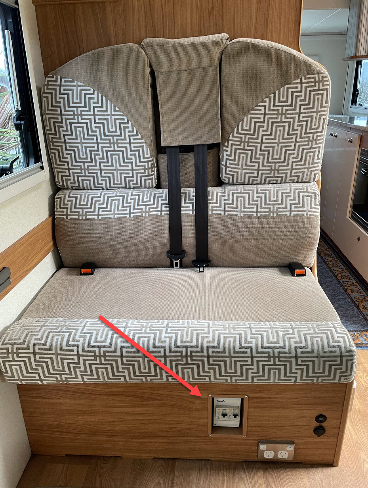
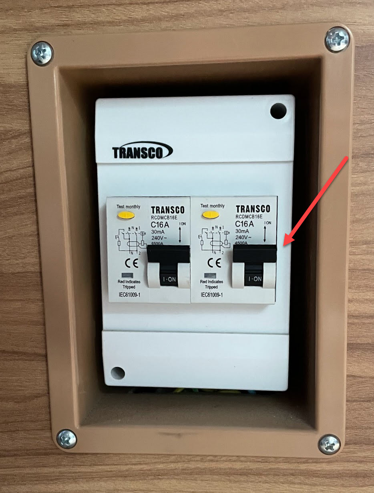

<link href="../styles/custom.css" rel="stylesheet" />
<link rel="stylesheet" href="https://cdn.jsdelivr.net/npm/bootstrap@4.6.1/dist/css/bootstrap.min.css" integrity="sha384-zCbKRCUGaJDkqS1kPbPd7TveP5iyJE0EjAuZQTgFLD2ylzuqKfdKlfG/eSrtxUkn" crossorigin="anonymous">

# Microwave Oven
Lillen has a 800W Compact Microwave Oven. 

    <svg class="svg-inline--fa fa-info-circle fa-w-16" aria-hidden="true" focusable="false" data-prefix="fas" data-icon="info-circle" role="img" xmlns="http://www.w3.org/2000/svg" viewBox="0 0 512 512" data-fa-i2svg=""><path fill="currentColor" d="M256 8C119.043 8 8 119.083 8 256c0 136.997 111.043 248 248 248s248-111.003 248-248C504 119.083 392.957 8 256 8zm0 110c23.196 0 42 18.804 42 42s-18.804 42-42 42-42-18.804-42-42 18.804-42 42-42zm56 254c0 6.627-5.373 12-12 12h-88c-6.627 0-12-5.373-12-12v-24c0-6.627 5.373-12 12-12h12v-64h-12c-6.627 0-12-5.373-12-12v-24c0-6.627 5.373-12 12-12h64c6.627 0 12 5.373 12 12v100h12c6.627 0 12 5.373 12 12v24z"></path></svg>
    <strong>Note:</strong> Connection to 240V mains power is required.

## Quick Reference Guide

## Manual
The manufacturers operating manual is available as a [PDF download](/docs/microwave-oven.pdf). 

## Troubleshooting
If the microwave oven will not power on follow the below steps.

1. Ensure that external 240V is connected by ensuring the 230V light is lit on the [Battery and Water Control Panel](/guides/control-panel.md).

2. Ensure that the 240v fuse has not tripped

The 240V Fuse Box is mounted on the passenger couch behind the driver seat.

The right fuse switch is for the microwave.

<a href="/#guides"><button class="nav-button"><i class="arrow arrow-left"></i> Back</button></a>

