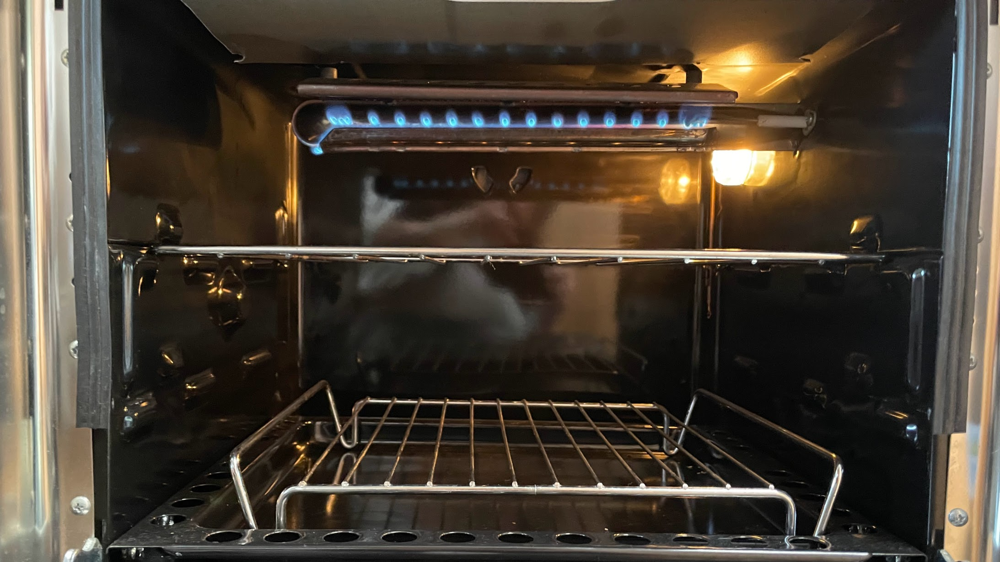
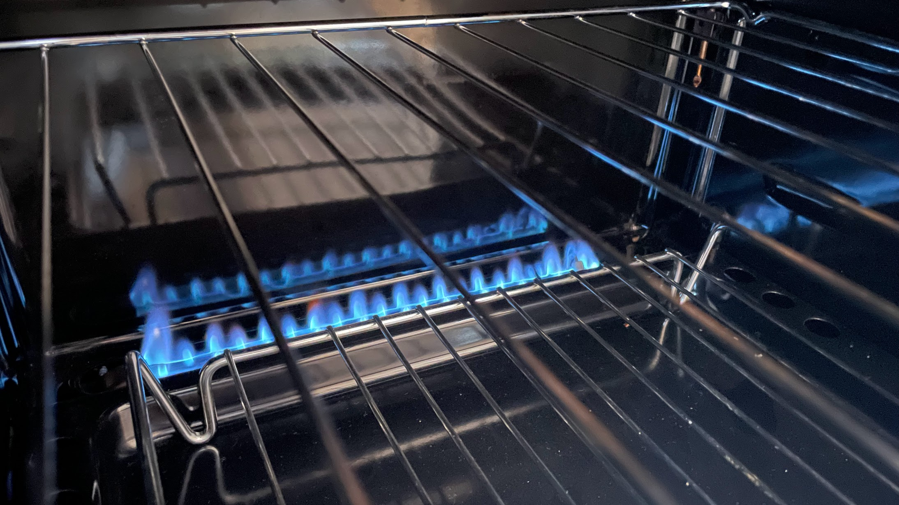
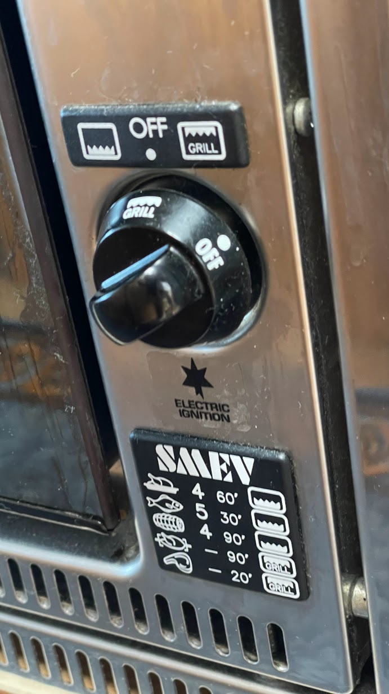
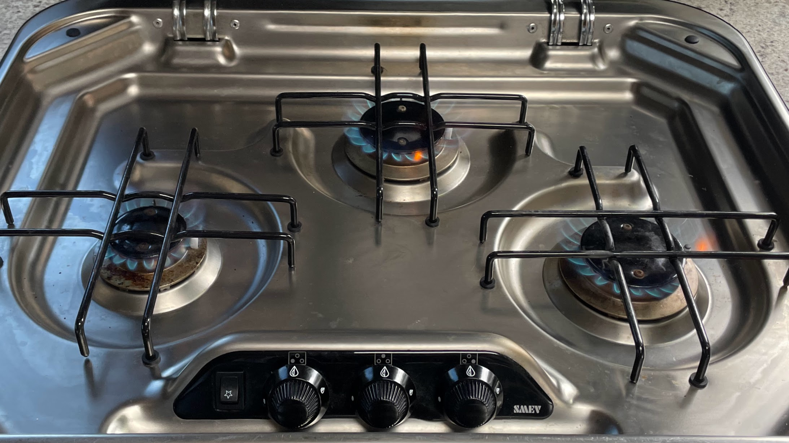
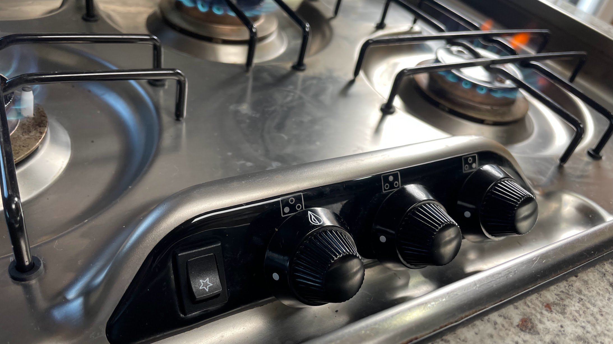
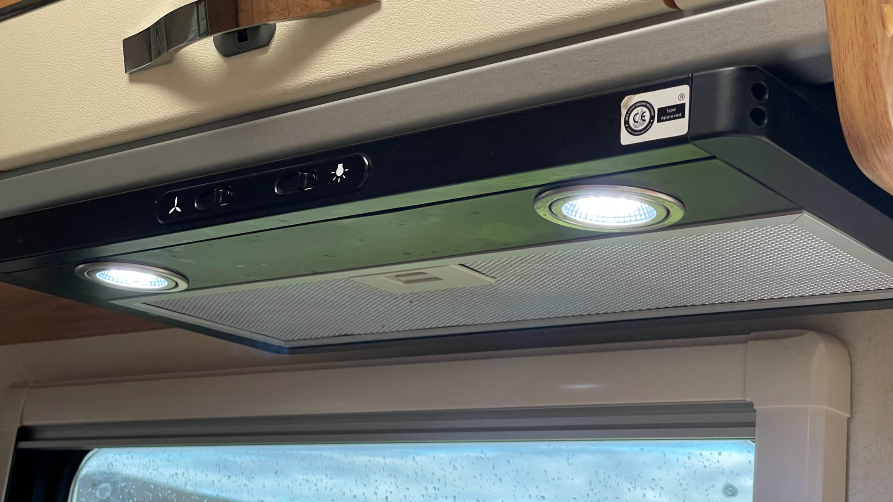

<link href="../styles/custom.css" rel="stylesheet" />
<link rel="stylesheet" href="https://cdn.jsdelivr.net/npm/bootstrap@4.6.1/dist/css/bootstrap.min.css" integrity="sha384-zCbKRCUGaJDkqS1kPbPd7TveP5iyJE0EjAuZQTgFLD2ylzuqKfdKlfG/eSrtxUkn" crossorigin="anonymous">

# Oven and Cooktop
Lillen's kitchen is equip with a gas oven with grill and a 3 burner gas cooktop. 

    <svg class="svg-inline--fa fa-triangle-exclamation fa-w-16" aria-hidden="true" focusable="false" data-prefix="fas" data-icon="triangle-exclamation" role="img" xmlns="http://www.w3.org/2000/svg" viewBox="0 0 512 512"><path fill="currentColor" d="M506.3 417l-213.3-364c-16.33-28-57.54-28-73.98 0l-213.2 364C-10.59 444.9 9.849 480 42.74 480h426.6C502.1 480 522.6 445 506.3 417zM232 168c0-13.25 10.75-24 24-24S280 154.8 280 168v128c0 13.25-10.75 24-23.1 24S232 309.3 232 296V168zM256 416c-17.36 0-31.44-14.08-31.44-31.44c0-17.36 14.07-31.44 31.44-31.44s31.44 14.08 31.44 31.44C287.4 401.9 273.4 416 256 416z"/></svg>  
    <strong>Important:</strong> Before igniting the oven and cooktop burners, verify that the gas alarm is working and open windows and sunroof hatch 
to ensure there is adequate ventilation.

## Oven
The oven has two modes, grill and conventional oven.

    <svg class="svg-inline--fa fa-info-circle fa-w-16" aria-hidden="true" focusable="false" data-prefix="fas" data-icon="info-circle" role="img" xmlns="http://www.w3.org/2000/svg" viewBox="0 0 512 512" data-fa-i2svg=""><path fill="currentColor" d="M256 8C119.043 8 8 119.083 8 256c0 136.997 111.043 248 248 248s248-111.003 248-248C504 119.083 392.957 8 256 8zm0 110c23.196 0 42 18.804 42 42s-18.804 42-42 42-42-18.804-42-42 18.804-42 42-42zm56 254c0 6.627-5.373 12-12 12h-88c-6.627 0-12-5.373-12-12v-24c0-6.627 5.373-12 12-12h12v-64h-12c-6.627 0-12-5.373-12-12v-24c0-6.627 5.373-12 12-12h64c6.627 0 12 5.373 12 12v100h12c6.627 0 12 5.373 12 12v24z"></path></svg>
    <strong>Info:</strong> It is not possible to operate both the grill and oven flames at the same time. 

Example of the grill burner.

Example of the oven burner.

### Ignition
To ignite the burner, push in and turn the control knob to a position from 1 to 6 and, keeping the knob pushed
in. 

Once the burner is lit, keep the knob pushed in for a few seconds to ensure the flame remains lit.

### Oven flame regulation with thermostat
| Position | Temperature |
|---|---|
| 1 | 130 &#8451; | 
| 2 | 160 &#8451; | 
| 3 | 180 &#8451; | 
| 4 | 200 &#8451; | 
| 5 | 220 &#8451; | 
| 6 | 240 &#8451; | 

When the oven burner is ignited the flame remains at high flame in all knob positions. When the oven reaches
the set temperature the flame automatically goes down to low flame.

## Cooktop
The cooktop has 3 gas burners with electronic ignition.

### Ignition
To ignite the burner, gently push in and turn the control knob to position HIGH FLAME and, keeping the knob
pushed in, at the same time press the electronic ignition pushbutton. 

Once the burner is lit, keep the knob pushed in for a few seconds to ensure the flame remains lit.

## Rangehood
A 12V rangehood with LED lighting is mounted over the cooktop.

## Manual
The manufacturers operating manual is available as a [PDF download](/docs/oven-and-cooktop.pdf). 

<a href="/#guides"><button class="nav-button"><i class="arrow arrow-left"></i> Back</button></a>

