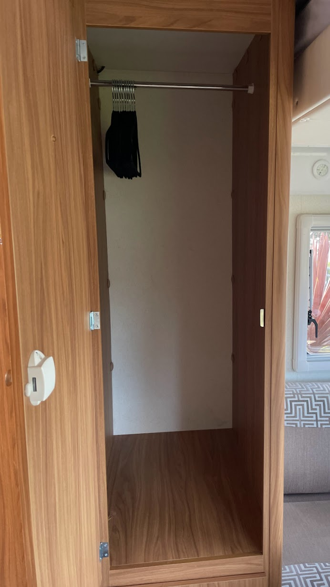

<link href="../styles/custom.css" rel="stylesheet" />
<link rel="stylesheet" href="https://cdn.jsdelivr.net/npm/bootstrap@4.6.1/dist/css/bootstrap.min.css" integrity="sha384-zCbKRCUGaJDkqS1kPbPd7TveP5iyJE0EjAuZQTgFLD2ylzuqKfdKlfG/eSrtxUkn" crossorigin="anonymous">

# Storage
Lillen has plenty of storage for a van this size.

## Wardrobe
The wardrobe has a lot of space.

## Cabinet under the Wardrobe
The cabinet udner the wardrobe is is not suitabel for storage as the hot water system is located here and the First Aid Kit 
takes up majority of the space.

    <svg class="svg-inline--fa fa-triangle-exclamation fa-w-16" aria-hidden="true" focusable="false" data-prefix="fas" data-icon="triangle-exclamation" role="img" xmlns="http://www.w3.org/2000/svg" viewBox="0 0 512 512"><path fill="currentColor" d="M506.3 417l-213.3-364c-16.33-28-57.54-28-73.98 0l-213.2 364C-10.59 444.9 9.849 480 42.74 480h426.6C502.1 480 522.6 445 506.3 417zM232 168c0-13.25 10.75-24 24-24S280 154.8 280 168v128c0 13.25-10.75 24-23.1 24S232 309.3 232 296V168zM256 416c-17.36 0-31.44-14.08-31.44-31.44c0-17.36 14.07-31.44 31.44-31.44s31.44 14.08 31.44 31.44C287.4 401.9 273.4 416 256 416z"/></svg>  
    <strong>Important:</strong> Do not place any items on top of the hot water system.

## Cabinets over the Passenger Couch

The cabinets over the passenger couch has removable shelves.

## Cabinet over the Fridge

The cabinets over the fridge can be used to store non perishable items. 

    <svg class="svg-inline--fa fa-triangle-exclamation fa-w-16" aria-hidden="true" focusable="false" data-prefix="fas" data-icon="triangle-exclamation" role="img" xmlns="http://www.w3.org/2000/svg" viewBox="0 0 512 512"><path fill="currentColor" d="M506.3 417l-213.3-364c-16.33-28-57.54-28-73.98 0l-213.2 364C-10.59 444.9 9.849 480 42.74 480h426.6C502.1 480 522.6 445 506.3 417zM232 168c0-13.25 10.75-24 24-24S280 154.8 280 168v128c0 13.25-10.75 24-23.1 24S232 309.3 232 296V168zM256 416c-17.36 0-31.44-14.08-31.44-31.44c0-17.36 14.07-31.44 31.44-31.44s31.44 14.08 31.44 31.44C287.4 401.9 273.4 416 256 416z"/></svg>  
    <strong>Warning:</strong> This cabinet gets very hot and humid.

## Measurements 

| Cabinet | Volume | Width | Height | Depth |
|---|---|---|---|---|
| Wardrobe | **351** Liters | 45cm | 120cm | 65cm |
| Left Cabinet over Passenger Couch | **47** Liters | 35cm | 45cm | 30cm |
| Middle Cabinet over Passenger Couch| **57** Liters | 42cm | 45cm | 30cm |
| Right Cabinet over Passenger Couch | **50** Liters | 37cm | 45cm | 30cm |
| Cabinet over Fridge | **53** Liters | 48cm | 25cm | 44cm |
| **TOTAL** | **558** Liters |

<a href="/#guides"><button class="nav-button"><i class="arrow arrow-left"></i> Back</button></a>

