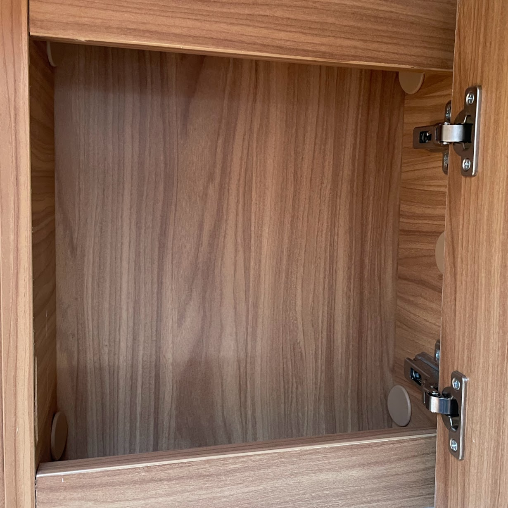

<link href="../styles/custom.css" rel="stylesheet" />
<link rel="stylesheet" href="https://cdn.jsdelivr.net/npm/bootstrap@4.6.1/dist/css/bootstrap.min.css" integrity="sha384-zCbKRCUGaJDkqS1kPbPd7TveP5iyJE0EjAuZQTgFLD2ylzuqKfdKlfG/eSrtxUkn" crossorigin="anonymous">

# Storage
Lillen has plenty of storage for a van this size.

    <svg class="svg-inline--fa fa-lightbulb fa-w-11" aria-hidden="true" focusable="false" data-prefix="fas" data-icon="lightbulb" role="img" xmlns="http://www.w3.org/2000/svg" viewBox="0 0 352 512" data-fa-i2svg=""><path fill="currentColor" d="M96.06 454.35c.01 6.29 1.87 12.45 5.36 17.69l17.09 25.69a31.99 31.99 0 0 0 26.64 14.28h61.71a31.99 31.99 0 0 0 26.64-14.28l17.09-25.69a31.989 31.989 0 0 0 5.36-17.69l.04-38.35H96.01l.05 38.35zM0 176c0 44.37 16.45 84.85 43.56 115.78 16.52 18.85 42.36 58.23 52.21 91.45.04.26.07.52.11.78h160.24c.04-.26.07-.51.11-.78 9.85-33.22 35.69-72.6 52.21-91.45C335.55 260.85 352 220.37 352 176 352 78.61 272.91-.3 175.45 0 73.44.31 0 82.97 0 176zm176-80c-44.11 0-80 35.89-80 80 0 8.84-7.16 16-16 16s-16-7.16-16-16c0-61.76 50.24-112 112-112 8.84 0 16 7.16 16 16s-7.16 16-16 16z"></path></svg>
    <strong>Tip:</strong> Two large suitcases can be stored on the <a href="/guides/bedding.html#bed-over-cab">bed over the cab</a> during the day and whilst driving. 
Then at night, they can be moved to the driver and passenger seats for bedtime.

## Wardrobe
The wardrobe has plenty of space and is provided with 10 hangers.

## Cupboard under the Wardrobe
The cupboard under the wardrobe is not suitable for storage as the hot water system is located here and the First Aid Kit 
takes up majority of the remainig space.

    <svg class="svg-inline--fa fa-triangle-exclamation fa-w-16" aria-hidden="true" focusable="false" data-prefix="fas" data-icon="triangle-exclamation" role="img" xmlns="http://www.w3.org/2000/svg" viewBox="0 0 512 512"><path fill="currentColor" d="M506.3 417l-213.3-364c-16.33-28-57.54-28-73.98 0l-213.2 364C-10.59 444.9 9.849 480 42.74 480h426.6C502.1 480 522.6 445 506.3 417zM232 168c0-13.25 10.75-24 24-24S280 154.8 280 168v128c0 13.25-10.75 24-23.1 24S232 309.3 232 296V168zM256 416c-17.36 0-31.44-14.08-31.44-31.44c0-17.36 14.07-31.44 31.44-31.44s31.44 14.08 31.44 31.44C287.4 401.9 273.4 416 256 416z"/></svg>  
    <strong>Important:</strong> Do not place any items on top of the hot water system.

## Cabinets behind the Driver Seat

There are three cabinets directly behind the drivers seat with removable shelves.

## Cabinet over the Fridge

The cabinet over the fridge can be used to store non perishable items. 

    <svg class="svg-inline--fa fa-triangle-exclamation fa-w-16" aria-hidden="true" focusable="false" data-prefix="fas" data-icon="triangle-exclamation" role="img" xmlns="http://www.w3.org/2000/svg" viewBox="0 0 512 512"><path fill="currentColor" d="M506.3 417l-213.3-364c-16.33-28-57.54-28-73.98 0l-213.2 364C-10.59 444.9 9.849 480 42.74 480h426.6C502.1 480 522.6 445 506.3 417zM232 168c0-13.25 10.75-24 24-24S280 154.8 280 168v128c0 13.25-10.75 24-23.1 24S232 309.3 232 296V168zM256 416c-17.36 0-31.44-14.08-31.44-31.44c0-17.36 14.07-31.44 31.44-31.44s31.44 14.08 31.44 31.44C287.4 401.9 273.4 416 256 416z"/></svg>  
    <strong>Warning:</strong> This cabinet gets very hot and humid.

## Bathroom cabinet

Over the bathroom sink there is small cabinet

## Bathroom cupboard

Under the bathroom sink there is small cupboard. 

    <svg class="svg-inline--fa fa-info-circle fa-w-16" aria-hidden="true" focusable="false" data-prefix="fas" data-icon="info-circle" role="img" xmlns="http://www.w3.org/2000/svg" viewBox="0 0 512 512" data-fa-i2svg=""><path fill="currentColor" d="M256 8C119.043 8 8 119.083 8 256c0 136.997 111.043 248 248 248s248-111.003 248-248C504 119.083 392.957 8 256 8zm0 110c23.196 0 42 18.804 42 42s-18.804 42-42 42-42-18.804-42-42 18.804-42 42-42zm56 254c0 6.627-5.373 12-12 12h-88c-6.627 0-12-5.373-12-12v-24c0-6.627 5.373-12 12-12h12v-64h-12c-6.627 0-12-5.373-12-12v-24c0-6.627 5.373-12 12-12h64c6.627 0 12 5.373 12 12v100h12c6.627 0 12 5.373 12 12v24z"></path></svg>
    <strong>Info:</strong> <a href="/guides/cassette-toilet.html#waste-tank-treatment">Bio-pak for waste tank treatment</a>, hand sanitiser and air freshner is provied and is stored here.

## Measurements 

|  | Volume | Width | Height | Depth |
|---|---|---|---|---|
| Wardrobe | **351** Liters | 45cm | 120cm | 65cm |
| Left Cabinets behind the Driver Seat | **47** Liters | 35cm | 45cm | 30cm |
| Middle Cabinets behind the Driver Seat | **57** Liters | 42cm | 45cm | 30cm |
| Right Cabinets behind the Driver Seat | **50** Liters | 37cm | 45cm | 30cm |
| Cabinet over Fridge | **53** Liters | 48cm | 25cm | 44cm |
| Bathroom Cabinet| **9** Liters | 27cm | 34cm | 10cm |
| Bathroom Cupboard | **45** Liters | 34cm | 39cm | 34cm |
| **TOTAL** | **612** Liters |

<a href="/#guides"><button class="nav-button"><i class="arrow arrow-left"></i> Back</button></a>

