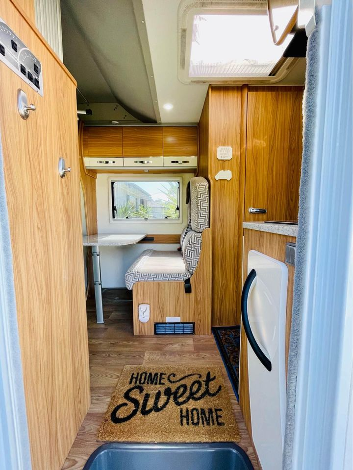
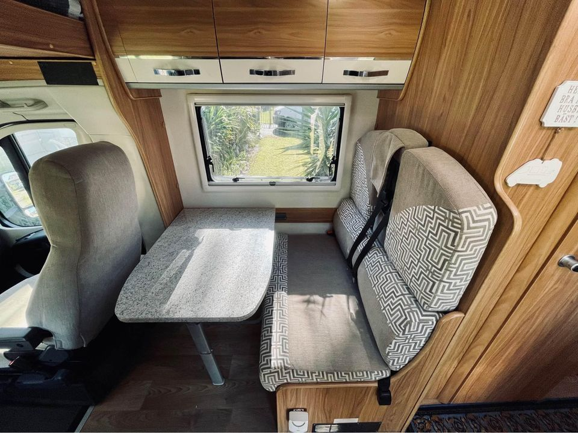
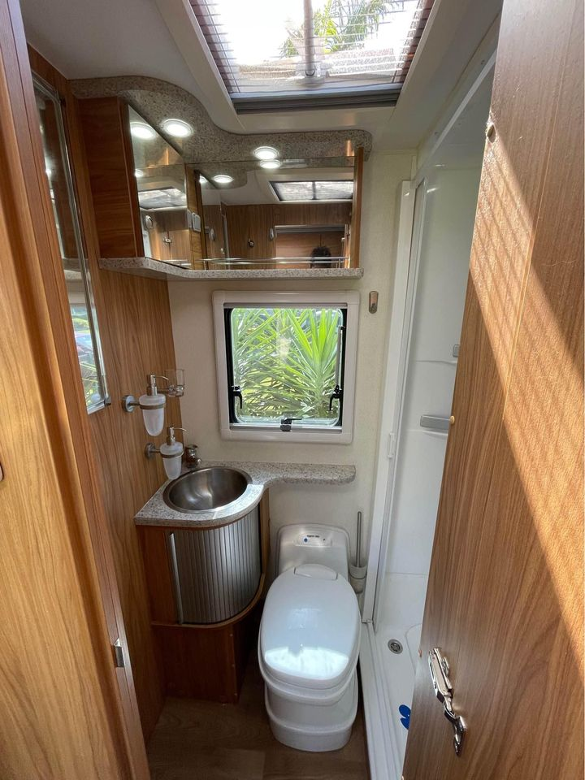
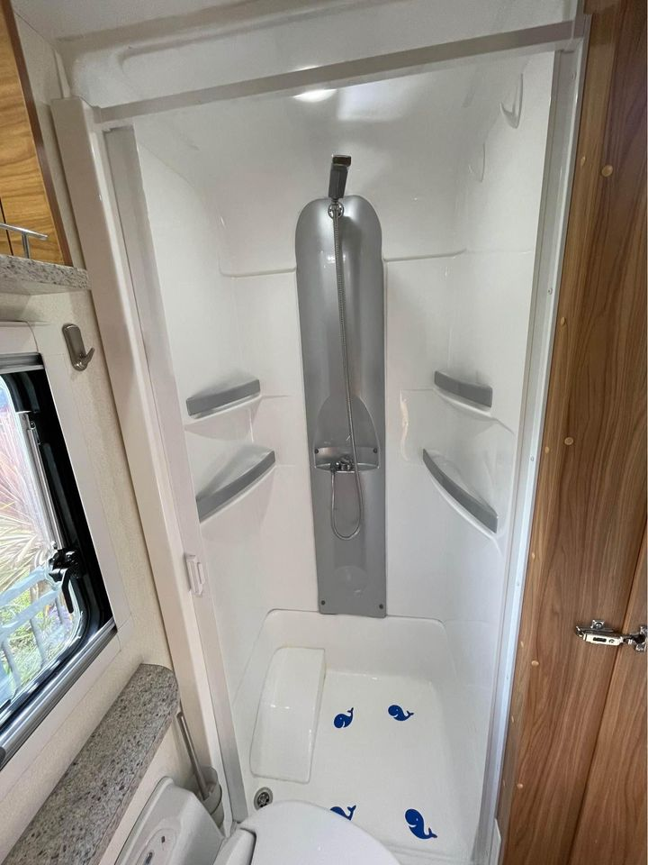

<link href="styles/custom.css" rel="stylesheet" />

  

      
      
      
      
      
      
      
      
     
      
      
      
      
      
   
      
  

  <button class="prev" onclick="previousImage()">&#10094;</button>
  <button class="next" onclick="nextImage()">&#10095;</button>

  

      
      
      
      
      
      
      
      
      
      
      
      
      
      
      
      
  

# For Sale: 2016 Avan Ovation M5 C-Class Motorhome
## Sleeps 4, Low KM, One Owner, Rego Until May 2025

This one-owner, well-maintained 2016 Avan Ovation M5 C-Class motorhome has only 28,000 km and is fully equipped for comfort, adventure, and extended trips. Registered until May 2025, it's road-ready for your next journey, offering a **very comfortable and easy-to-drive** experience.

**Price:** $139,990  
**Location:** Woy Woy, NSW  
**Mileage:** 28,000 km  

### Key Features

- **Sleeps 4 comfortably** – Features a spacious electric drop-down bed for two adults and an additional bed over the cab.
- **Spacious lounge area** – Large windows, ample seating, and a drop-down bed for versatility and comfort.
- **Swivel front seats** – Maximise living space when parked, enhancing comfort.
- **Fully equipped kitchen** – 3-burner gas cooktop, gas oven with grill, microwave, and a 185L two-door 3-way fridge/freezer.
- **Private bathroom** – Separate shower and toilet for home-like convenience.
- **Entertainment system** – Integrated TV and stereo system.
- **Climate control** – Air conditioning and heating for year-round comfort in any weather.
- **Smooth driving experience** – Powered by a 3.0L Fiat Ducato turbo diesel engine, automatic 6-speed transmission, and cruise control.
- **Bullbar installed** – Extra protection for rural and off-road journeys.
- **Thule 2-bike carrier** – Conveniently bring bikes on your adventures.
- **Easy wind-out awning with festoon lights** – Create a cosy outdoor space.
- **Ambient lighting** – LED downlights and feature strip lighting for a warm atmosphere.
- **Off-grid capabilities** – Solar panels, water tanks, diesel heater, and a 125-litre diesel tank for extended trips.
- **Outdoor shower** – Hot and cold water for convenience after outdoor activities.
- **Additional features** – Reversing camera, GPS navigation, ample storage, and a full service history.

Full list of **[features & specifications](specifications/index.md)**.

**Included Extras:** Camping chairs, table, annex mat.

**Bonus:** Comprehensive **[checklists and guides](guides/index.md)** to help the new owner make the most out of the van quickly.

### Layout

Make sure that you check out **[Caravan World's review](review/index.md)** of the Avan Ovation M5 from 2016.

Explore Australia’s hidden gems in comfort and style. With its one-owner history, low mileage, climate control, and registration valid until May 2025, it’s the perfect choice for your next adventure.

**Contact Mikael today on 0422 441 135 or [owner@lillen.au](mailto:owner@lillen.au) to arrange a viewing!**



