<link href="styles/custom.css" rel="stylesheet" />

  

      <a href="images/lillen.jpg" target="_blank">
          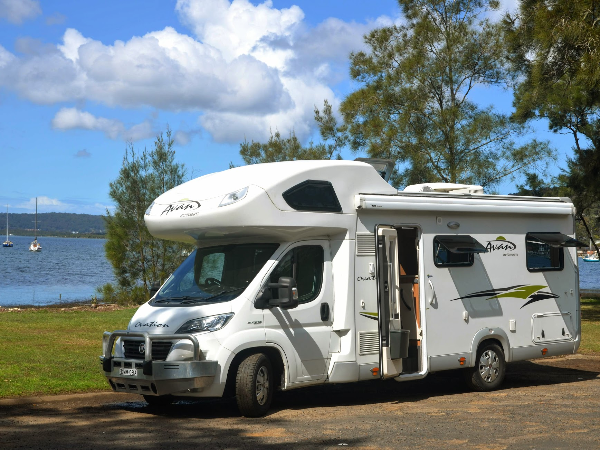
      </a>
      <a href="images/window.jpg" target="_blank">
          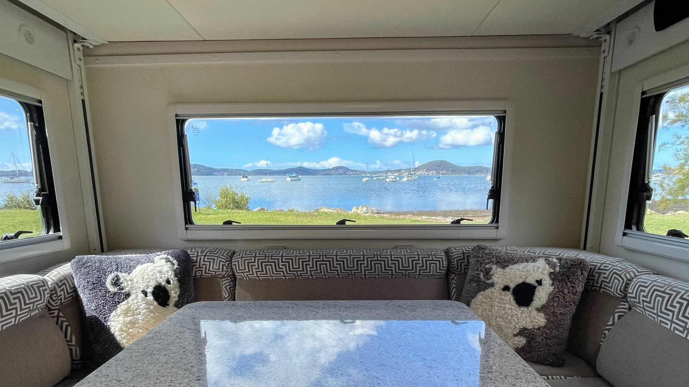
      </a>
      <a href="images/festoon-lights.jpg" target="_blank">
          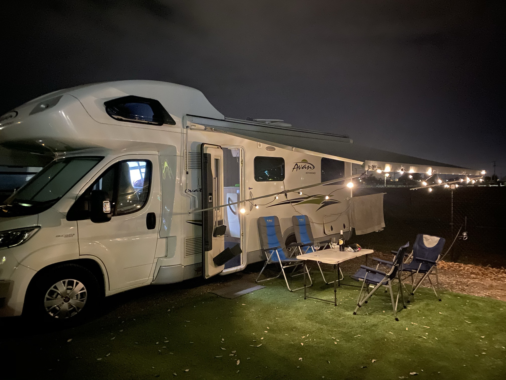
      </a>
      <a href="images/left-side.jpg" target="_blank">
          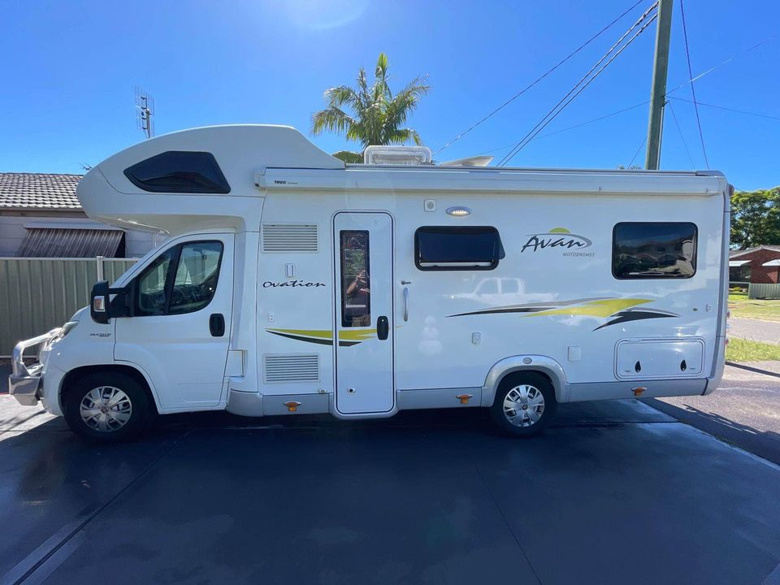
      </a>
      <a href="images/rear.jpg" target="_blank">
          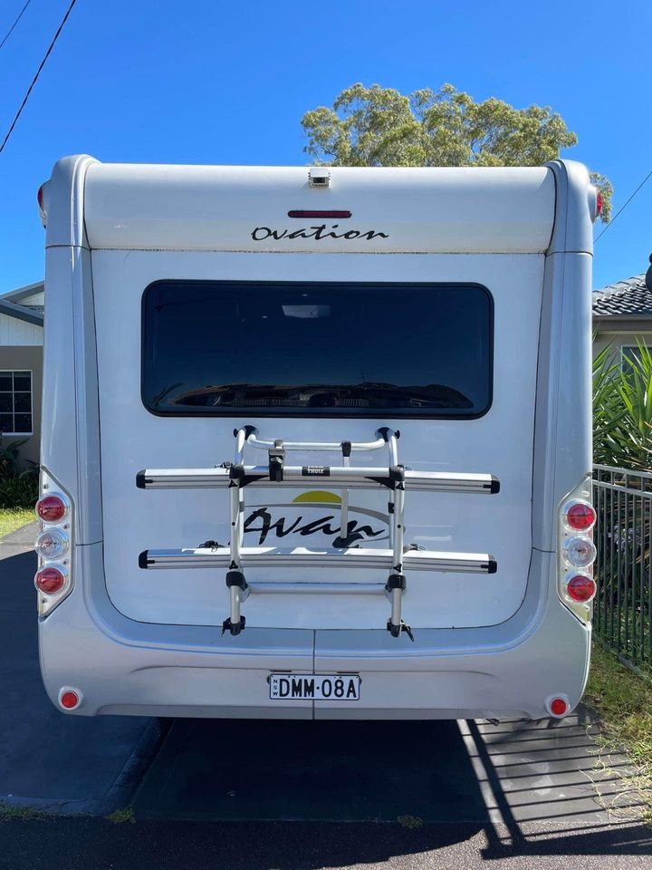
      </a>
      <a href="images/drivers-seat.jpg" target="_blank">
          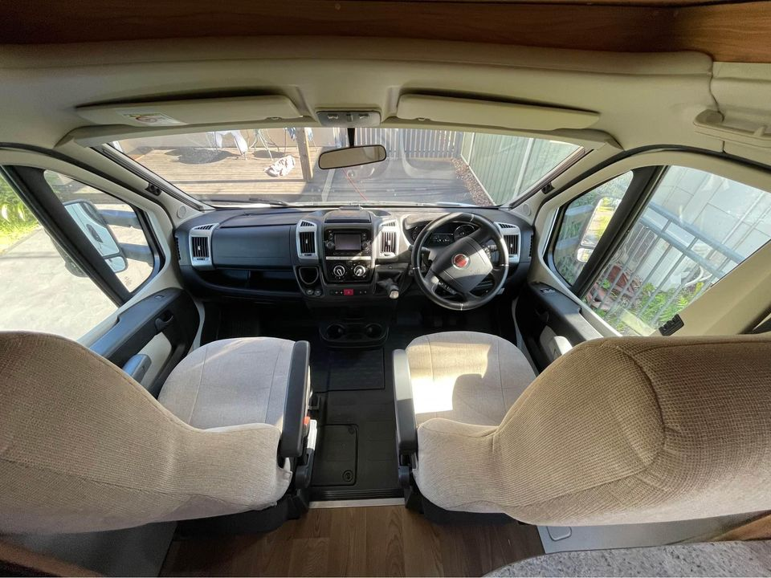
      </a>
      <a href="images/front-table.jpg" target="_blank">
          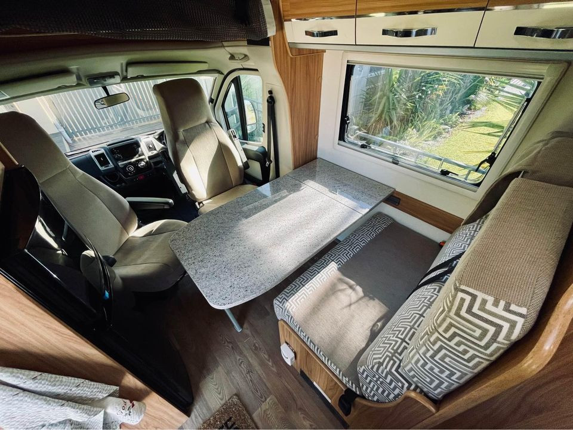
      </a>
      <a href="images/kitchen.jpg" target="_blank">
          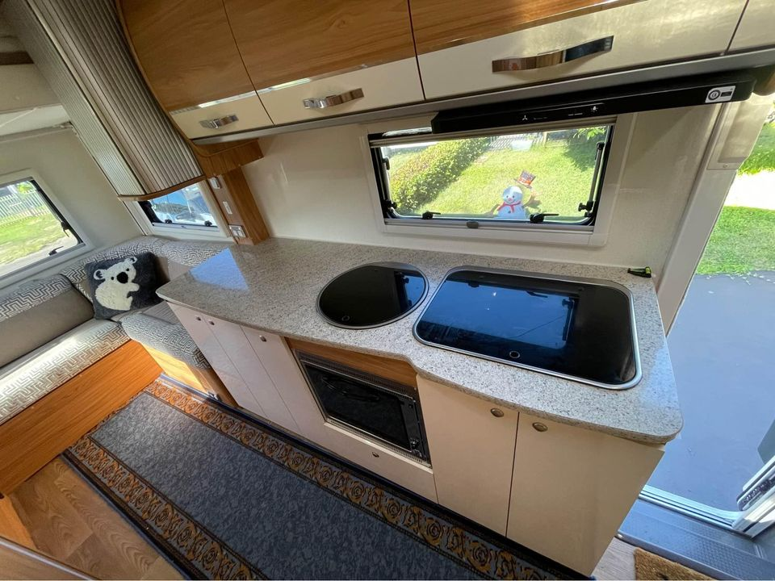
      </a>
      <a href="images/lounge-area.jpg" target="_blank">
          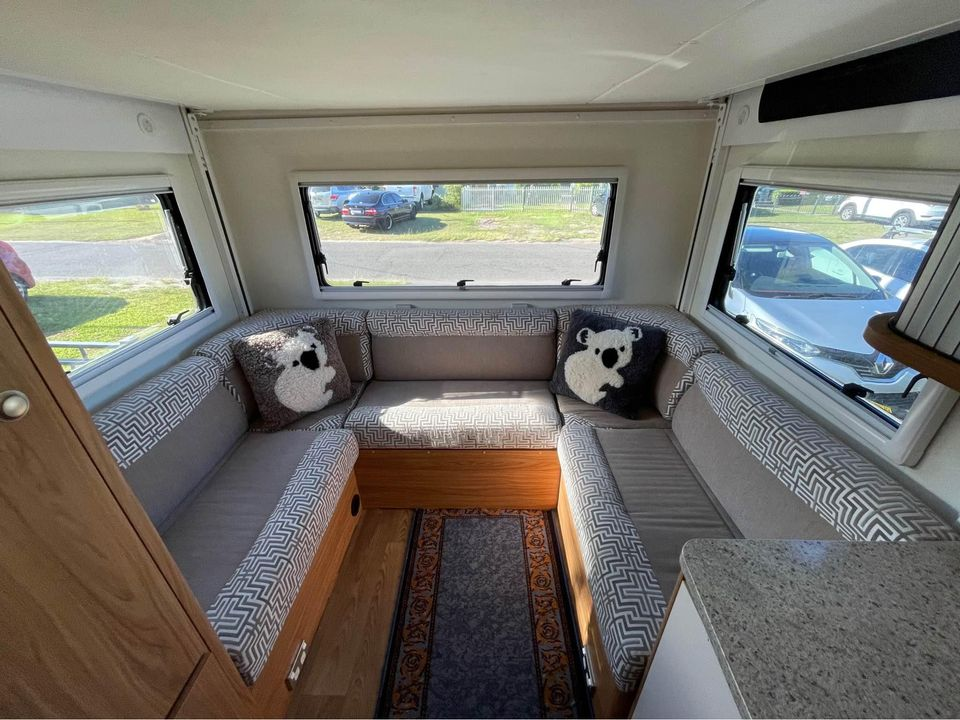
      </a>
      <a href="images/bed.jpg" target="_blank">
          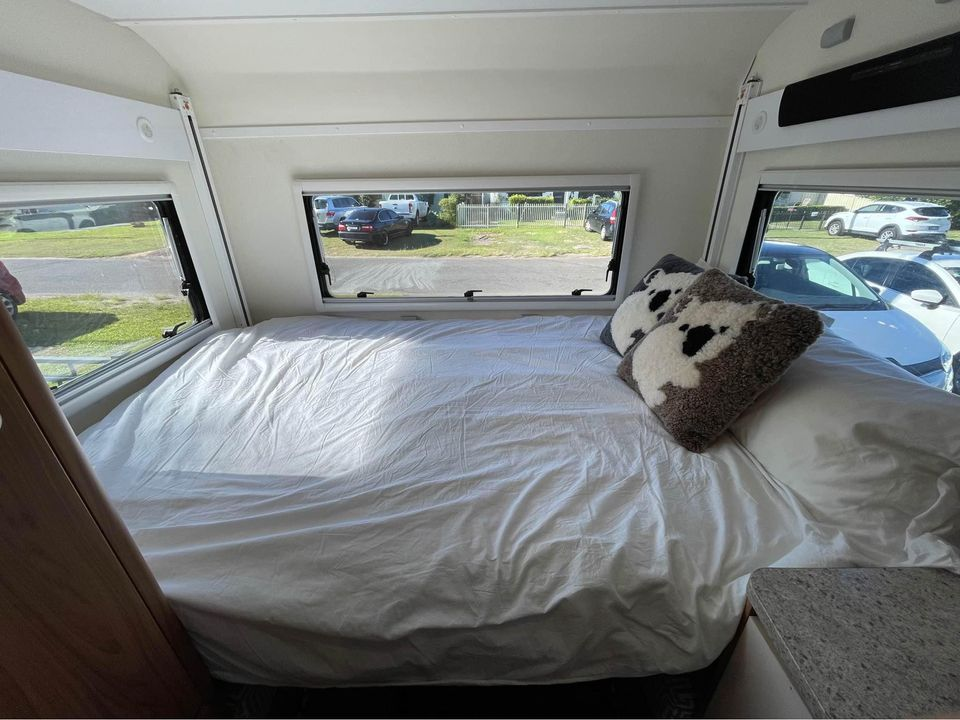
      </a>
      <a href="images/bunk-bed.jpg" target="_blank">
          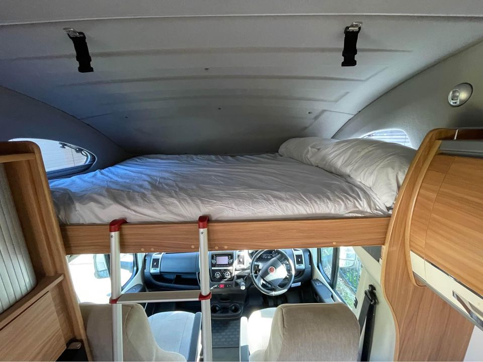
      </a>
      <a href="images/odometer.jpg" target="_blank">
          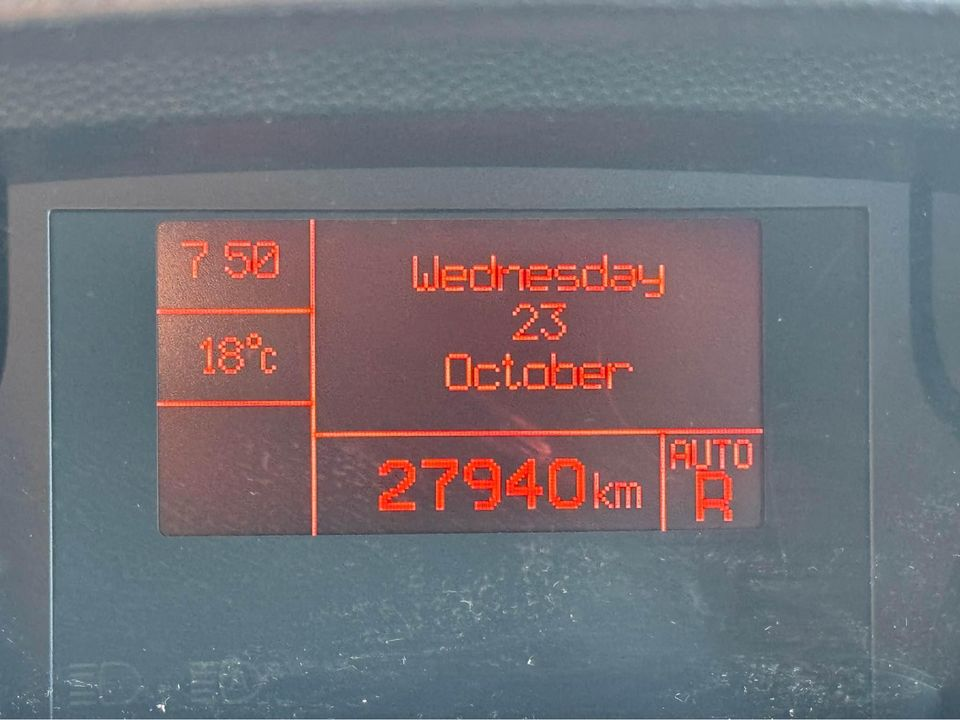
      </a>
  

  <button class="prev" onclick="previousImage()">&#10094;</button>
  <button class="next" onclick="nextImage()">&#10095;</button>

  

      
      
      
      
      
      
      
      
      
      
      
      
  

# For Sale: 2016 Avan Ovation M5 C-Class Motorhome
## Sleeps 4, Low KM, One Owner, Rego Until May 2025

This one-owner, well-maintained 2016 Avan Ovation M5 C-Class motorhome has only 28,000 km and is fully equipped for comfort, adventure, and extended trips. Registered until May 2025, it's road-ready for your next journey, offering a **very comfortable and easy-to-drive** experience.

**Price:** $139,990 AUD  
**Location:** Woy Woy, NSW  
**Mileage:** 28,000 km  

### Key Features

- **Sleeps 4 comfortably** – Features a large electric drop-down bed that sleeps two adults and an additional bed over the cab for guests.
- **Great size lounge area** – Spacious seating with large windows and a large electric drop-down bed for extra comfort.
- **Swivel front seats for driver and passenger** – Maximises the living area when parked.
- **Fully equipped kitchen** – Includes a 3-burner gas cooktop, gas oven with grill, microwave, and a two-door 3-way 185L fridge (155L fridge and 30L freezer) for all your cooking needs.
- **Private bathroom** – Separate shower and toilet for added convenience.
- **Entertainment system** – TV and stereo for downtime during your trip.
- **Air conditioning** – Enjoy year-round comfort with efficient cooling in hot weather and reliable heating for colder days, ensuring a pleasant environment in all conditions.
- **Smooth driving experience** – Powered by a 3.0L Fiat Ducato turbo diesel engine with automatic 6-speed transmission and cruise control.
- **Bullbar installed** – Provides extra protection for rural or off-road journeys.
- **Thule 2-bike carrier** – Perfect for cyclists, making it easy to bring your bikes along.
- **Easy wind-out awning with festoon lights** – Creates a warm and inviting alfresco space for outdoor relaxation.
- **LED downlights and feature strip lighting** – Enhances the interior ambience.
- **Off-grid ready** – Equipped with solar panels, water tanks, a diesel heater, and a 125-litre diesel fuel tank for extended off-grid trips.
- **Additional features** – Reversing camera, GPS navigation, external shower, ample storage, and full service history.
- **Included extras** – Camping chairs, table, and annex mat for outdoor comfort.

### Floorplan

<a href="images/floorplan.jpg" target="_blank">
    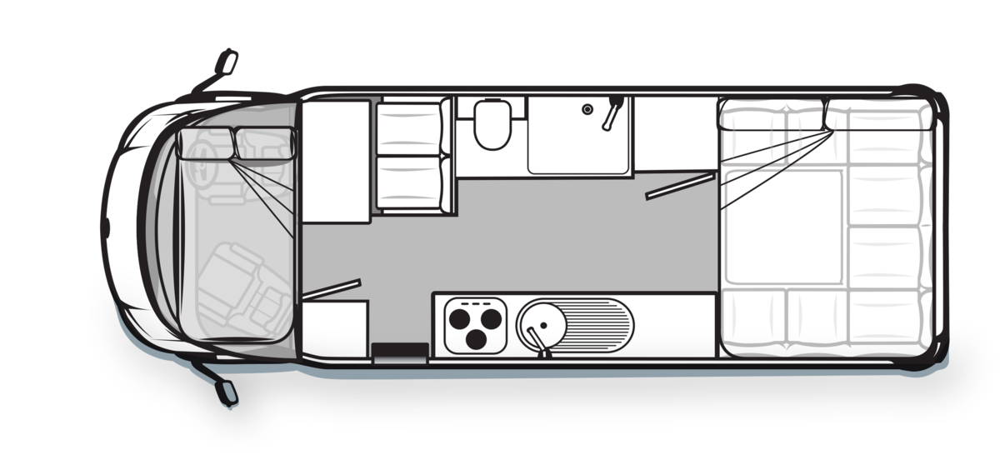
</a>

Make sure that you check out **[Caravan World's review](review/index.md)** of the Avan Ovation M5 from 2016.

I’ve also provided **[comprehensive checklists and guides](guides/index.md)** to help the new owner make the most out of the van quickly.

**Explore Austalia's hidden gems in comfort and style.** With its one-owner history, low mileage, air conditioning, and rego until May 2025, it’s the perfect choice for your next adventure.

Contact Mikael today on 0422 441 135 or [owner@lillen.au](mailto:owner@lillen.au) to arrange a viewing!



