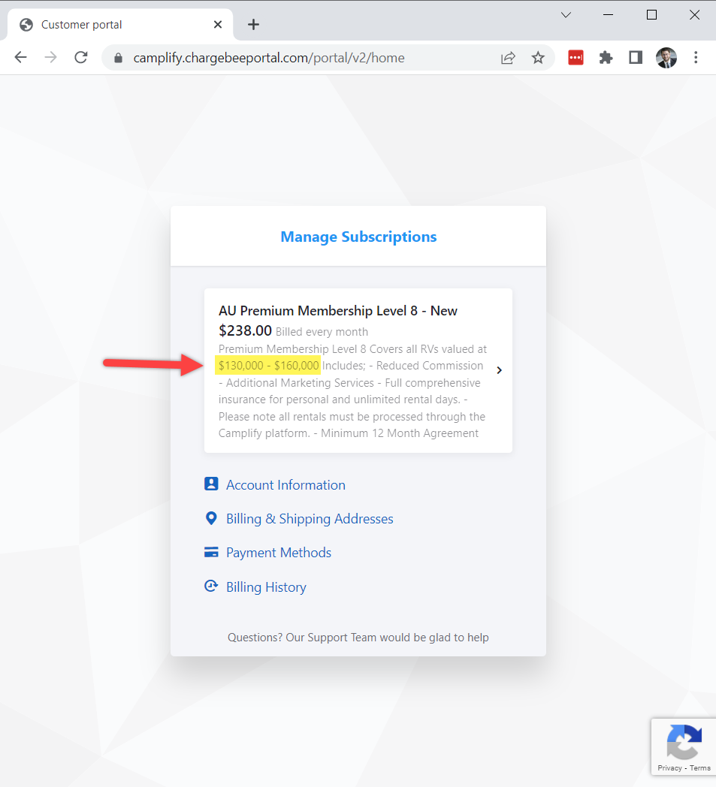

<link href="../../../styles/custom.css" rel="stylesheet" />

# Owner Insurance
Lillen's is insured throught Camplify Premium Membership Subscription and is included on Camplify's 
fleet insurance policy. 

## Market Value
Lillen is insured at a market value of **$130k-$160k** in the **Premium Membership Level 8** tier.

## Excess
Excess is **$1,000 per incident** for the owner personal use any Additional Driver. At time of writing, Camplify does not offer 
any excess reduction for owners personal use.

> If Your Vehicle is covered for personal use Vehicle and there is Damage
and Loss while Your Vehicle is deemed to be in Your possession, Your
excess will be $1000.
> 
> *See page 12 in [Camplify Fleet Policy Summary](../docs/insurance/Camplify_Fleet_Policy_Summary_Inclusions_Exclusions_AU_01102021-a598a417fb437b7a0ea3f5ea7ad4f850178a58596c61bbb158564b211ee7af0c.pdf)*

## Hirer Insurance and Excess Reduction
Camplify provides information about [hirer insuarnce](https://www.camplify.com.au/hirer-insurance) and [hirer accident excess reduction](https://www.camplify.com.au/accident-excess)

## Documents
- [Certificate of Currency](../docs/insurance/Mikael-Hallin--Camplify-Insuret-COC.pdf)
- [Welcome - Important Information](../docs/insurance/Welcome-Important-Information.pdf)
- [Premium Membership Agreement](../docs/insurance/Premium_Membership_Agreements_AU_01102021-ef9fa79eff886944e1e1809bcbc5058268c052c381822fb55748fffeb27a0bf3.pdf)
- [Camplify Fleet Policy Summary](../docs/insurance/Camplify_Fleet_Policy_Summary_Inclusions_Exclusions_AU_01102021-a598a417fb437b7a0ea3f5ea7ad4f850178a58596c61bbb158564b211ee7af0c.pdf)

<a href="../"><button class="nav-button"><i class="arrow arrow-left"></i> Back</button></a>

Updated: 12/05/2022

