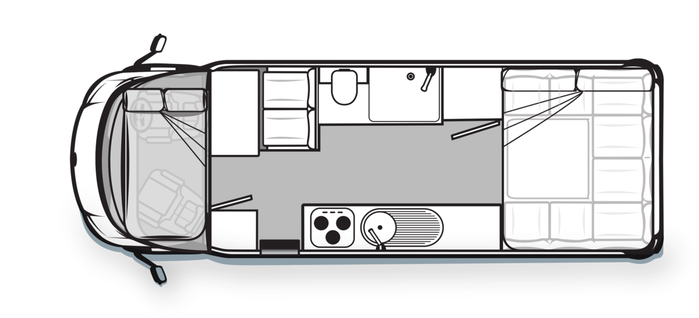

<link href="../styles/custom.css" rel="stylesheet" />

# Avan Ovation M5 C Class

## Specifications

| **Length** | **Width** | **Height** | **Kerb Mass** | **GVM**  |
|------------|-----------|------------|---------------|----------|
| 7.17 m     | 2.77 m    | 3.03 m     | 3292 kg       | 4400 kg  |

## Engine Specifications
- Four Cylinders
- N-Line DOHC
- Turbocharged Common Rail 180 Multijet
- 3L Turbo Diesel Engine

## Fiat Ducato Specifications
- Power steering & adjustable steering
- Keyless central locking 
- Electric windows & mirrors 
- AM / FM radio with CD
- Air conditioning 
- 6-Speed automatic (MTA) gearbox 
- Special motorhome chassis: lower, lighter, stronger, with greater torsional stiffness
- Wider rear track (1980mm) for enhanced stability, safety & living space
- 125-Litre diesel fuel tank
- Licensed to carry 4 passengers
- Swivel seats with dual armrests
- Factory colour-coded painted bumper
- 150 amp alternator for rapid power replenishment
- 4.25 tonne GVM (4490 kg on M6 & M7)
- Front & rear disc brakes
- Active safety features: ABS, EBD, ASR
- GPS Navigation System

## Avan Ovation M5 Features
- Wind-out awning
- Double-glazed opening windows with integrated screen & blind system
- Full en-suite with separate shower, vanity, and toilet
- Fully equipped kitchen with microwave oven and hot water service
- Roof-mounted air conditioner
- Swivel front seats for driver & passenger
- Flat screen LCD TV on a swivel bracket
- DVD/CD/Radio system
- Hot & cold mains pressure mixing taps
- 95-amp deep cycle house battery
- Provision for 2 x 9 kg gas bottles & 2 house batteries
- Fresh water tank (103L) & grey water tank (110L)
- LED down lights & directional interior lights
- 18 Amp charger & 12-volt control panel
- Lockable water filler & wind-up TV antenna
- Awning light & bathroom roof hatch
- Opening skylight with integrated fly screen and blind
- Gas-assisted bed struts for extra storage
- Sub-floor construction:
  - 9mm polypropylene sheet (maintenance free)
  - One-piece vinyl flooring
  - Raised flooring for additional storage
- Ample storage areas
- Full block-out front blinds for windshield, driver, & passenger doors.

## Layout

<a href="/"><button class="nav-button"><i class="arrow arrow-left"></i> Back</button></a>

